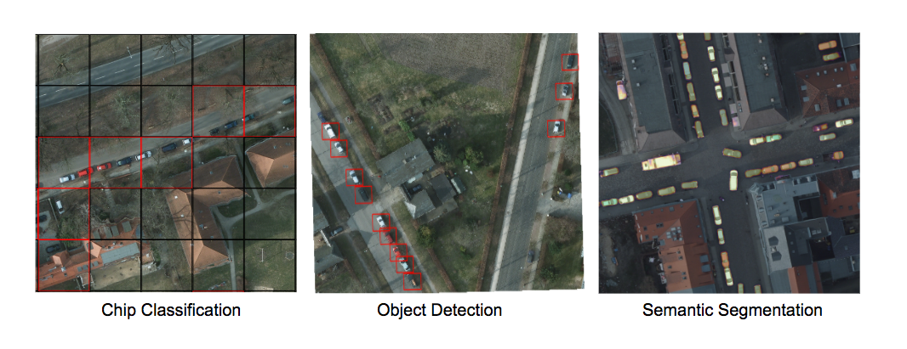
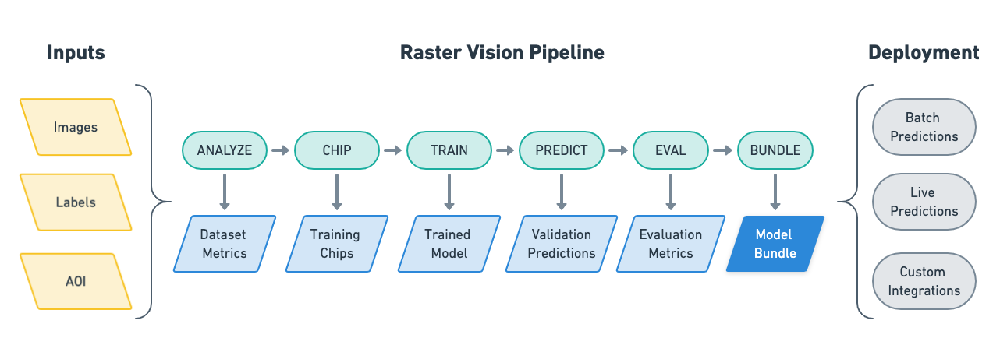

&nbsp;

[](https://pypi.org/project/rastervision/)
[](https://docs.rastervision.io/en/stable/?badge=stable)
[](https://opensource.org/licenses/Apache-2.0)
[](https://github.com/azavea/raster-vision/actions/workflows/release.yml)
[](https://codecov.io/gh/azavea/raster-vision)

Raster Vision is an open source Python **library** and **framework** for building computer vision models on satellite, aerial, and other large imagery sets (including oblique drone imagery).

It has built-in support for chip classification, object detection, and semantic segmentation with backends using PyTorch.

<div align="center">
    
</div>

**As a library**, Raster Vision provides a full suite of utilities for dealing with all aspects of a geospatial deep learning workflow: reading geo-referenced data, training models, making predictions, and writing out predictions in geo-referenced formats.

**As a low-code framework**, Raster Vision allows users (who don't need to be experts in deep learning!) to quickly and repeatably configure experiments that execute a machine learning pipeline including: analyzing training data, creating training chips, training models, creating predictions, evaluating models, and bundling the model files and configuration for easy deployment.


Raster Vision also has built-in support for running experiments in the cloud using [AWS Batch](https://github.com/azavea/raster-vision-aws).

See the [documentation](https://docs.rastervision.io/en/stable/) for more details.

## Installation

*For more details, see the [Setup documentation](https://docs.rastervision.io/en/stable/setup/)*.

### Install via `pip`

You can install Raster Vision directly via `pip`.

```sh
pip install rastervision
```

### Use Pre-built Docker Image

Alternatively, you may use a Docker image. Docker images are published to [quay.io](https://quay.io/repository/azavea/raster-vision) (see the *tags* tab).

We publish a new tag per merge into `master`, which is tagged with the first 7 characters of the commit hash. To use the latest version, pull the `latest` suffix, e.g. `raster-vision:pytorch-latest`. Git tags are also published, with the Github tag name as the Docker tag suffix.

### Build Docker Image

You can also build a Docker image from scratch yourself. After cloning this repo, run `docker/build`, and run then the container using `docker/run`.

## Usage Examples and Tutorials

**Non-developers** may find it easiest to use Raster Vision as a low-code framework where Raster Vision handles all the complexities and the user only has to configure a few parameters. The [*Quickstart guide*](https://docs.rastervision.io/en/stable/framework/quickstart.html) is a good entry-point into this. More advanced examples can be found on the [*Examples*](https://docs.rastervision.io/en/stable/framework/examples.html) page.

For **developers** and those looking to dive deeper or combine Raster Vision with their own code, the best starting point is [*Usage Overview*](https://docs.rastervision.io/en/stable/usage/overview.html), followed by [*Basic Concepts*](https://docs.rastervision.io/en/stable/usage/basics.html) and [*Tutorials*](https://docs.rastervision.io/en/stable/usage/tutorials/index.html).


## Contact and Support

You can ask questions and talk to developers (let us know what you're working on!) at:
* [Discussion Forum](https://github.com/azavea/raster-vision/discussions)
* [Mailing List](https://groups.google.com/forum/#!forum/raster-vision)

## Contributing

*For more information, see the [Contribution page](https://docs.rastervision.io/en/stable/CONTRIBUTING.html).*

We are happy to take contributions! It is best to get in touch with the maintainers
about larger features or design changes *before* starting the work,
as it will make the process of accepting changes smoother.

Everyone who contributes code to Raster Vision will be asked to sign the
Azavea CLA, which is based off of the Apache CLA.

1. Download a copy of the [Raster Vision Individual Contributor License
   Agreement](docs/_static/cla/2018_04_17-Raster-Vision-Open-Source-Contributor-Agreement-Individual.pdf)
   or the [Raster Vision Corporate Contributor License
   Agreement](docs/_static/cla/2018_04_18-Raster-Vision-Open-Source-Contributor-Agreement-Corporate.pdf)

2. Print out the CLAs and sign them, or use PDF software that allows placement of a signature image.

3. Send the CLAs to Azavea by one of:
  - Scanning and emailing the document to cla@azavea.com
  - Faxing a copy to +1-215-925-2600.
  - Mailing a hardcopy to:
    Azavea, 990 Spring Garden Street, 5th Floor, Philadelphia, PA 19107 USA
