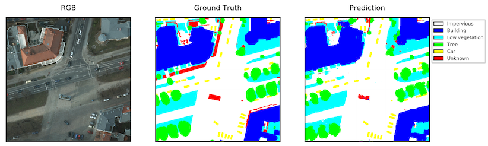
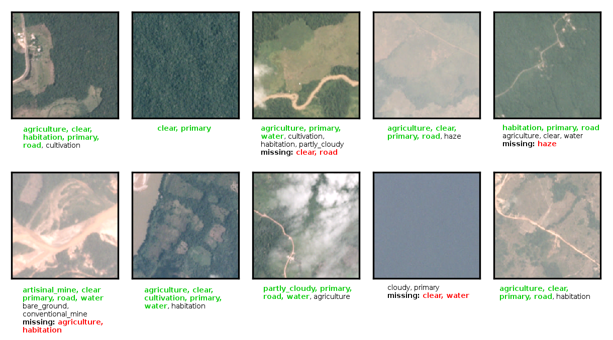

# Raster Vision

[](https://opensource.org/licenses/Apache-2.0)

## Introduction

The goal of this project is to create a system for analyzing aerial and satellite imagery using deep learning that works on a variety of tasks and datasets. At the moment, we have implemented approaches for semantic segmentation, and are working on tagging/recognition. In the future we may add support for object detection. There is code for building Docker containers, running experiments on AWS EC2 using [AWS Batch](https://aws.amazon.com/batch/), loading and processing data, and constructing, training and evaluating models
using the [Keras](https://keras.io/) and [Tensorflow](https://www.tensorflow.org/) libraries.

### Semantic Segmentation
The goal of semantic segmentation is to infer a meaningful label such as "road" or "building" for each pixel in an image. Here is an example of an aerial image segmented using a model learned by our system.



More details on this feature can be found in this [blog post](https://www.azavea.com/blog/2017/05/30/deep-learning-on-aerial-imagery/).

The following datasets and model architectures are implemented.

#### Datasets
* [ISPRS Potsdam 2D dataset](http://www2.isprs.org/commissions/comm3/wg4/2d-sem-label-potsdam.html)
* [ISPRS Vaihingen 2D dataset](http://www2.isprs.org/commissions/comm3/wg4/2d-sem-label-vaihingen.html)

#### Model architectures
* [FCN](https://arxiv.org/abs/1411.4038) (Fully Convolutional Networks) using [ResNets](https://arxiv.org/abs/1512.03385)
* [U-Net](https://arxiv.org/abs/1505.04597)
* [Fully Convolutional DenseNets](https://arxiv.org/abs/1611.09326) (aka the 100 Layer Tiramisu)

### Tagging / Recognition

The goal of tagging is to infer a set of labels for each image. Here are some examples of training chips from the [Planet Kaggle competition](https://www.kaggle.com/c/planet-understanding-the-amazon-from-space) with labels predicted by our best single-model network, a DenseNet121 using the Adam optimizer.



There are 17 possible tags: agriculture, artisinal_mine, bare_ground, blooming, blow_down, clear, cloudy, conventional_mine, cultivation, habitation, haze, partly_cloudy, primary, road, selective_logging, slash_burn, water. In the above figure, the ground truth tags (ie. tagged by hand) for the Planet Kaggle dataset are bolded. Green bolded tags are correct. Unbolded and uncolored tags mean that they have been incorrectly predicted for the chip. Red bolded tags are ones missed by the network prediction.

In order for this task to perform accurately, it is important that the labeling criteria be distinct and unambiguous in the training data. For example, we can see that the network often mistakes when to label a chip with the tag `agriculture`. However, if we examine the ground truth tags for each chip, it's not obvious that the human classifications are correct either.

The following datasets and model architectures are implemented.

#### Datasets
* [Planet: Understanding the Amazon from Space (Kaggle Competition)](https://www.kaggle.com/c/planet-understanding-the-amazon-from-space)

#### Model architectures
* [ResNet50](https://arxiv.org/abs/1512.03385)
* [Inception v3](https://arxiv.org/abs/1512.00567)
* [DenseNet121](https://arxiv.org/abs/1608.06993)
* [DenseNet169](https://arxiv.org/abs/1608.06993)

## Usage

### Requirements

- Vagrant 1.8+
- VirtualBox 4.3+
- Python 2.7
- Ansible 2.1+

### Scripts

| Name     | Description                              |
| -------- | ---------------------------------------- |
| `cipublish`  | Publish docker image to ECR |
| `clean`  | Remove build outputs inside virtual machine |
| `infra`  | Execute Terraform subcommands            |
| `test`   | Run unit tests and lint on source code |
| `run` | Run container locally or remotely |
| `jupyter` | Run container with juptyer notebook with mounted data and notebook directory from `RASTER_VISION_NOTEBOOK_DIR` |
| `setup`  | Bring up the virtual machine and install dependent software on it |
| `setup_aws_batch`  | Setup AWS Batch |
| `submit_jobs`  | Submit jobs to AWS Batch |
| `update` | Install dependent software inside virtual machine |
| `upload_code` | Upload code to EC2 instance for rapid debugging |

### Initial setup

First, set the `RASTER_VISION_DATA_DIR` environment variable on your host machine. If you are not at Azavea and want to use the deployment code, you will need to set the `RASTER_VISION_S3_BUCKET` environment variable and update various values in
[deployment/terraform/variables.tf](deployment/terraform/variables.tf).

From within the project root, execute the following commands.

```bash
$ ./scripts/setup
$ vagrant ssh
```

You will be prompted to enter credentials for AWS, along with a default region. These credentials will be used to authenticate calls to the AWS API when using the AWS CLI and Terraform.

## Running locally on CPUs

### Data directory

All data including datasets and results are stored in a single directory outside of the repo. The `Vagrantfile` maps the `RASTER_VISION_DATA_DIR` environment variable on the host machine to `/opt/data` on the guest machine. The datasets are stored in `/opt/data/datasets` and results are stored in `/opt/data/results`.

### Running the Docker container

You can get into the bash console for the Docker container which has Keras and Tensorflow installed with
```shell
vagrant ssh
vagrant@raster-vision:/vagrant$ ./scripts/update --cpu
vagrant@raster-vision:/vagrant$ ./scripts/run --cpu
```

### Running a Jupyter Notebook instance

You can run a juptyer notebook that has the data from `RASTER_VISION_DATA_DIR` mounted to `/opt/data`
and `RASTER_VISION_NOTEBOOK_DIR` mounted to `/opt/notebooks` and set as the juptyer notebook directory.

```shell
vagrant ssh
vagrant@raster-vision:/vagrant$ ./scripts/update --jupyter
vagrant@raster-vision:/vagrant$ ./scripts/jupyter
```

### Preparing datasets
These are instructions for replicating our setup from scratch. If you are at Azavea, the prepared data is already on S3 and you can download it from there onto your local machine. The directories mentioned below are assumed to be relative to the `RASTER_VISION_DATA_DIR`.

#### ISPRS
Before running any experiments locally, the data needs to be prepared so that Keras can consume it. For the
[ISPRS 2D Semantic Labeling Potsdam dataset](http://www2.isprs.org/commissions/comm3/wg4/2d-sem-label-potsdam.html), you can download the data after filling out the [request form](http://www2.isprs.org/commissions/comm3/wg4/data-request-form2.html).
After following the link to the Potsdam dataset, download
`1_DSM_normalisation.zip`, `4_Ortho_RGBIR.zip`, `5_Labels_for_participants.zip`, and `5_Labels_for_participants_no_Boundary.zip`. Then unzip the files into
`datasets/isprs/potsdam/`, resulting in `datasets/isprs/potsdam/1_DSM_normalisation/`, etc.

For the [ISPRS 2D Semantic Labeling Vaihingen dataset](http://www2.isprs.org/commissions/comm3/wg4/2d-sem-label-vaihingen.html) dataset, download `ISPRS_semantic_labeling_Vaihingen.zip` and `ISPRS_semantic_labeling_Vaihingen_ground_truth_eroded_for_participants.zip`. Then unzip the files into `datasets/isprs/vaihingen/`, resulting in
`datasets/isprs/vaihingen/dsm/`, `datasets/isprs/vaihingen/gts_for_participants/`, etc.

Then run `python -m rastervision.semseg.data.factory all all all`. This takes about 30 minutes and will generate `datasets/isprs/processed_potsdam/` and `datasets/isprs/processed_vaihingen/`, as well as PDF files that visualize samples produced by the data generator in  `results/gen_samples/`. You can also run the command for a specific task, dataset, and generator. For instance, you can run `python -m rastervision.semseg.data.factory isprs/potsdam numpy plot`.
 To make the processed data available for use on EC2, upload a zip file of `datasets/isprs/processed_potsdam/` named `processed_potsdam.zip` (and similar for Vaihingen) to `s3://<RASTER_VISION_S3_BUCKET>/datasets/isprs/`.

#### Planet Kaggle
The data is available from the Kaggle [website](https://www.kaggle.com/c/planet-understanding-the-amazon-from-space/data) and requires logging in. For running locally, you will need to create a directory `datasets/planet_kaggle/`, and place the  `train-tif-v2/` and `test-tif-v2/` directories in it, as well as the `train_v2.csv` file. To save disk space, you can just keep a small sample of the data in these directories for testing purposes. You will then need to convert the corresponding 7zip files into zip files and upload them to `s3://<RASTER_VISION_S3_BUCKET>/datasets/planet_kaggle/`. To test that the generator works for this dataset, you can run `python -m rastervision.semseg.taging.factory planet_kaggle tiff plot`, which will generate debug plots in `results/gen_samples/`.

### Running experiments

An experiment consists of training a model on a dataset using a particular set of hyperparameters. Each experiment is defined using an options `json` file,
which contains fields such as `problem_type` (`semseg` or `tagging`), `dataset_name`, `model_type`, and `run_name` (which is used as an ID for the experiment, and should be unique).
An example can be found in [potsdam_quick_test.json](src/experiments/tests/semseg/potsdam_quick_test.json), and this
can be used as a quick integration test.
In order to run an experiment, you invoke `python -m rastervision.run <experiment.json> <list of tasks>`. The list of available tasks varies based on the `problem_type`. The format of experiment files and available tasks is evolving rapidly, so you should look at the source code and existing experiment files for guidance.

Here are some examples of how to use the `run` command.
```shell
# Run all tasks by default
python -m rastervision.run experiments/tests/semseg/potsdam_quick_test.json
# Only run the plot_curves tasks which requires that train_model were previously run
python -m rastervision.run experiments/tests/semseg/potsdam_quick_test.json plot_curves
```
This will generate a directory structure in `results/<run_name>/` which contains the options file, the learned model, and various metrics and visualization files.

### Generating experiment files

When running a large number of experiments in parallel, it is convenient to generate the experiment files via a script. You can do this by extending the `ExperimentGenerator` class and then running it. For example, running `python experiments/tests/generator/generate_experiments.py` will create an `experiments` subdirectory, and fill it with generated experiment files.

## Running remotely on AWS EC2 GPUs

In order to run experiments on GPUs and in parallel, we use AWS EC2. There are two ways to use EC2: by manually spinning up an EC2 instance and then ssh'ing into it, or by submitting a set of jobs to run in parallel via AWS Batch. The results are saved to the S3 bucket after each epoch and the final evaluation. If a run is terminated for any reason and you would like to resume it, simply restart the run, and it should pick up where it left off.

### Publishing the container to ECR

The latest Docker image should be stored in ECR so that it can be downloaded onto EC2 instances. To build and publish the container, run `./scripts/cipublish`.

### Submit jobs to AWS Batch

#### `setup_aws_batch`
To setup the AWS Batch stack, which should only be done once per AWS account, run `./scripts/setup_aws_batch`. To submit a set of jobs to Batch, use the `submit_jobs` script. The syntax for invoking it is `./scripts/submit_jobs <branch_name> <experiment_path> <space separated list of tasks> --attempts <# of attempts>`. The `branch_name` should be the name of the branch with the code to run, `experiment_path` should be a directory full of experiment json files rooted at `src/experiments` (or a single json file), and the list of tasks should contain the task you want to run. By default, the job will be attempted five times. If you are testing a job to see if it might fail, you should run it with `--attempts 1` so that it won't be retried if it fails. For example, you could run
```shell
./scripts/submit_jobs lf/batch src/experiments/tests/generator/experiments train_model validation_eval
```
After submitting jobs, AWS Batch will start an EC2 instance for each experiment and will shut them down when finished.

#### Updating the Batch AMI

Use `deployment/batch_amis.py` to update the Batch environment AMI. This requires your `raster-vision` AWS profile to be configured.

```bash
$ aws --profile raster-vision configure
$ cd deployment
$ pip install -r requirements.txt
$ ./batch_amis.py  build-amis --aws-profile raster-vision
...
==> Builds finished. The artifacts of successful builds are:
--> raster-vision-gpu: AMIs were created:

us-east-1: ami-fb5c7980
```

Use the AMI ID provided above, to update the ComputeResources > imageId field in `deployment/batch/compute_environment_{gpu,cpu}.json`. To apply these changes, delete the existing Batch environments using the AWS Console, and then re-run the steps in the section above.

Prune any old AMIs by using the `prune-amis` command to `batch_amis.py`
```bash
$ ./batch_amis.py  prune-amis --keep 10
```
### Run directly on EC2

For debugging purposes, it may be desirable to start an EC2 spot instance (with the container image and this repo downloaded), log into the instance, and run the container manually. This can be done with Terraform using the `infra` script. The following command will start 1 instance and print their
public DNS names.
```bash
vagrant@vagrant-ubuntu-trusty-64:/vagrant$ ./scripts/infra start 1
```

Afterwards, navigate to the [spot request](https://console.aws.amazon.com/ec2sp/v1/spot/home?region=us-east-1#) section of the EC2 console to monitor the request's progress. Once fulfilled, a running instance will visible in the [instances](https://console.aws.amazon.com/ec2/v2/home?region=us-east-1#Instances:sort=instanceId) section.

After starting an instance, `ssh` into it with
```shell
ssh-add ~/.aws/raster-vision.pem
ssh ec2-user@<public dns>
```

Then you can train a model with
```shell
cd raster-vision
./scripts/run --gpu
root@230fb62d8ecd:/opt/src# python -m rastervision.run experiments/tests/semseg/potsdam_quick_test.json
```

⚠️️ When finished with all the instances, you should shut them down with
```shell
./scripts/infra destroy
```
