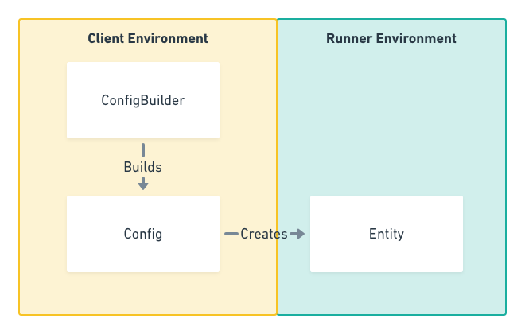

Codebase Design Patterns
========================

Configuration vs Entity
-----------------------

In Raster Vision we keep a separation between configuration of a thing and the creation of the thing itself.
This allows us to keep the *client environment*, i.e. the environment that is running the ``rastervision`` cli
application, and the *runner environment*, i.e. the environment that is actually running commands, totally separate. This means you can install Raster Vision and run experiments on a machine doesn't have a GPU or any machine learning library installed, but can issue commands to an environment that does. This also lets us work with configuration on the client side very quickly, and leave all the heavy lifting to the runner side.

This separation expressed in a core design principle that is seen across the codebase: the use of the `Config` and `ConfigBuilder` classes.

Config
^^^^^^

The ``Config`` class represents the configuration of a component of the experiment. It is a declaritive encapsulation of exactly what we want to run, without actually running anything. We are able to serialize Configs, and because they describe exactly what we want to do, they become historical artifacts about what happened, messages for running on remote systems, and records that let us repeat experiments and verify results.

The construction of configuration can include some heavy logic, and we want a clean separation from the Config and the way we construct it.  This is why each Config has a separate ``ConfigBuilder`` class.

ConfigBuilder
^^^^^^^^^^^^^

The ``ConfigBuilder`` classes are the main interaction point for users of Raster Vision. They are generally instantiated when client code calls the static ``.builder()`` method on the ``Config``. If there are multiple types of builders, a key is used to state which builder should be returned (e.g. with ``rv.BackendConfig.builder(rv.KERAS_CLASSIFICATION)``. The usage of keys to return specific builder types allows for two things: 1. a standard interface for constructing builders that only changes based on the parameter passed in, and 2. a way for plugins to register their own keys, so that using plugins feels exactly like using core Raster Vision code.

The ConfigBuilders are immutable data structures that use what's called a *fluent builder patter*. When you call a method on a builder that sets a property, what you're actually doing is creating a copy of the builder and returning it. Not modifying internal state allows us to fork builders into different transformed objects without having to worry about modifying the internal properties of the builders earlier in the chain of modifications. Using a fluent builder pattern also gives us a readable and standard way of creating and transforming ConfigBuilders and Configs.

The ConfigBuilder also has a ``.validate()`` call that is called whenever ``.build()`` is called, which gives the ConfigBuilder the chance to make sure all required properties are set and are sane. One major advantage of using the ConfigBuilder pattern over simply having long ``__init__`` methods on ``Config`` objects is that you can set up builders in one part of the code, without setting required properties, and pass it off to another decoupled part of the code that can use the builder further. As long as the required properties are set before ``build()`` is called, you can set as little or as many properties as you want.

.. _builder pattern:

Fluent Builder Pattern
----------------------

The ConfigBuilders in Raster Vision use a fluent builder design pattern.
This allows the composition and chaining together of transformations on builders,
which encourages readable configuration code. The usage of builders is always as follows:

* The Config type (SceneConfig, TaskConfig, etc) will always be available through the top level import (which generally is ``import rastervision as rv``)
* The ConfigBuilder is created from the static method on the Config class, e.g. ``rv.TaskConfig.builder(rv.OBJECT_DETECTION)``. Keys for builder types are also always exposed in the top level package (unless your key is for a custom plugin, in which case you're on your own).
* The builder is then transformed using the `.with_*()` methods.
  Each call to a `.with_*()` method returns a new copy of the builder with the modifications set,
  which means you can chain them together. This is the "fluent" part of the fluent builder pattern.
* You call ``.build()`` when you are ready for your fully baked ``Config`` object.

You can also call ``.to_builder()`` on any ``Config`` object, which lets you move between the ``Config`` and ``ConfigBuilder`` space easily. This is useful when you want to take a config that was deserialized or constructed in some other way and use it as a base for further transformation.

.. _global registry:

Global Registry
---------------

Another major design pattern of Raster Vision is the use of a global registry. This is what gives the ability for the single interface to construct all subclass builders through the static ``builder()`` method on the ``Config`` via a key, e.g. ``rv.RasterSourceConfig.builder(rv.GEOTIFF_SOURCE)``. The key is used to look up what ConfigBuilders are registered inside the global registery, and the registry determines what builder to return from the ``build()`` call. More importantly, this enables Raster Vision to have a flexible system to create :ref:`plugins` out of anything that has a keyed ConfigBuilder. The registry pattern goes beyond Configs and ConfigBuilders, though: this is also how internal classes and plugins are chosen for :ref:`default provider`, :ref:`experiment runner`, and :ref:`filesystem`.
