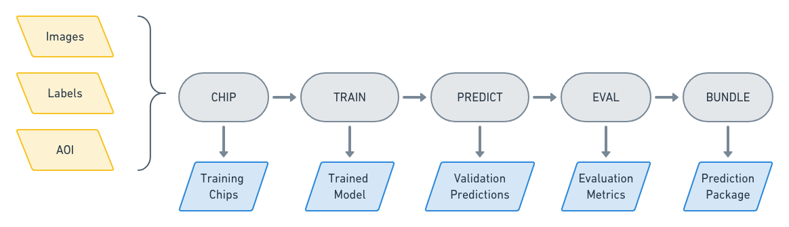

.. _commands:

Commands
========

Command Types
-------------

A Raster Vision experiment is a sequence of commands that each run a component of a machine learning workflow.

ANALYZE
^^^^^^^

The ANALYZE command is used to analyze scenes that are part of an experiment and produce some output that can be consumed by later commands. Geospatial raster sources such as GeoTIFFs often contain 16- and 32-bit pixel color values, but many deep learning libraries expect 8-bit values. In order to perform this transformation, we need to know the distribution of pixel values. So one usage of the ANALYZE command is to compute statistics of the raster sources and save them to a JSON file which is later used by the StatsTransformer (one of the available :ref:`raster transformer`) to do the conversion.

CHIP
^^^^

Scenes are comprised of large geospatial raster sources (eg. GeoTIFFs) and geospatial label sources (eg. GeoJSONs), but models can only consume small images (i.e. chips) and labels in pixel based-coordinates. In addition, each backend has its own dataset format. The CHIP command solves this problem by converting scenes into training chips and into a format the backend can use for training.

TRAIN
^^^^^

The TRAIN command is used to train a model using the dataset generated by the CHIP command. The command is a thin wrapper around the train method in the backend that synchronizes files with the cloud, configures and calls the training routine provided by the associated third-party machine learning library, and sets up a log visualization server in some cases (e.g. Tensorboard). The output is a trained model that can be used to make predictions and fine-tune on another dataset.

PREDICT
^^^^^^^

The PREDICT command makes predictions for a set of scenes using a model produced by the TRAIN command. To do this, a sliding window is used to feed small images into the model, and the predictions are transformed from image-centric, pixel-based coordinates into scene-centric, map-based coordinates.

EVAL
^^^^

The EVAL command evaluates the quality of models by comparing the predictions generated by the PREDICT command to ground truth labels. A variety of metrics including F1, precision, and recall are computed for each class (as well as overall) and are written to a JSON file.

BUNDLE
^^^^^^

The BUNDLE command gathers files necessary to create a prediction package from the output of the previous commands. A prediction package contains a model file plus associated configuration data, and can be used to make predictions on new imagery in a deployed application.
