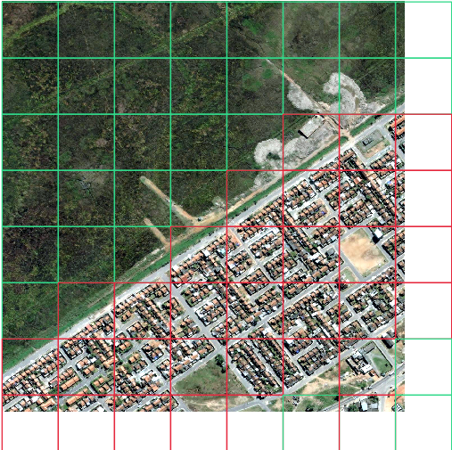
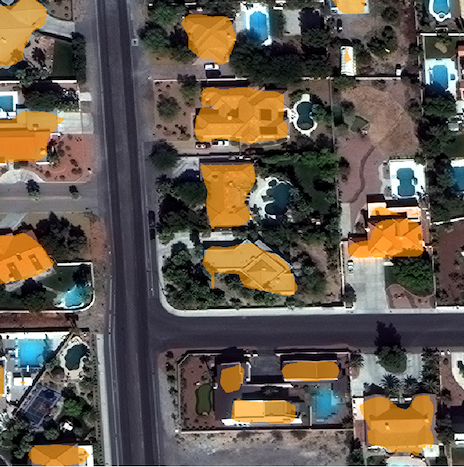
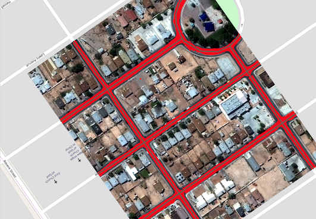
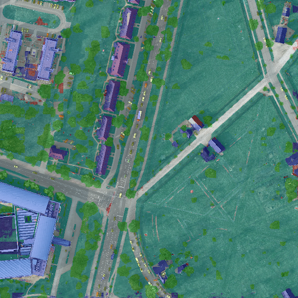

.. _rv examples:

Examples
=========

This page contains `examples <https://github.com/azavea/raster-vision/tree/0.12/rastervision_pytorch_backend/rastervision/pytorch_backend/examples>`_ of using Raster Vision on open datasets. Unless otherwise stated, all commands should be run inside the Raster Vision Docker container. See :ref:`docker images` for info on how to do this.

How to Run an Example
---------------------

There is a common structure across all of the examples which represents a best practice for defining experiments. Running an example involves the following steps.

* Acquire raw dataset.
* (Optional) Get processed dataset which is derived from the raw dataset, either using a Jupyter notebook, or by downloading the processed dataset.
* (Optional) Do an abbreviated test run of the experiment on a small subset of data locally.
* Run full experiment on GPU.
* Inspect output
* (Optional) Make predictions on new imagery

Each of the examples has several arguments that can be set on the command line:

* The input data for each experiment is divided into two directories: the raw data which is publicly distributed, and the processed data which is derived from the raw data. These two directories are set using the ``raw_uri`` and ``processed_uri`` arguments.
* The output generated by the experiment is stored in the directory set by the ``root_uri`` argument.
* The ``raw_uri``, ``processed_uri``, and ``root_uri`` can each be local or remote (on S3), and don't need to agree on whether they are local or remote.
* Experiments have a ``test`` argument which runs an abbreviated experiment for testing/debugging purposes.

In the next section, we describe in detail how to run one of the examples, SpaceNet Rio Chip Classification. For other examples, we only note example-specific details.

Chip Classification: SpaceNet Rio Buildings
--------------------------------------------

This example performs chip classification to detect buildings on the Rio AOI of the `SpaceNet <https://spacenetchallenge.github.io/>`_ dataset.

Step 1: Acquire Raw Dataset
~~~~~~~~~~~~~~~~~~~~~~~~~~~~

The dataset is stored on AWS S3 at ``s3://spacenet-dataset``. You will need an AWS account to access this dataset, but it will not be charged for accessing it. (To forward you AWS credentials into the container, use ``docker/run --aws``).

Optional: to run this example with the data stored locally, first copy the data using something like the following inside the container.

.. code-block:: terminal

    aws s3 sync s3://spacenet-dataset/AOIs/AOI_1_Rio/ /opt/data/spacenet-dataset/AOIs/AOI_1_Rio/

Step 2: Run the Jupyter Notebook
~~~~~~~~~~~~~~~~~~~~~~~~~~~~~~~~~~

You'll need to do some data preprocessing, which we can do in the Jupyter notebook supplied.

.. code-block:: terminal

    docker/run --jupyter [--aws]

The ``--aws`` option is only needed if pulling data from S3. In Jupyter inside the browser, navigate to the `rastervision/examples/chip_classification/spacenet_rio_data_prep.ipynb <https://github.com/azavea/raster-vision/tree/0.12/rastervision_pytorch_backend/rastervision/pytorch_backend/examples/chip_classification/spacenet_rio_data_prep.ipynb>`_ notebook. Set the URIs in the first cell and then run the rest of the notebook. Set the ``processed_uri`` to a local or S3 URI depending on where you want to run the experiment.

.. image:: img/examples/jupyter.png
  :width: 500
  :alt: Jupyter Notebook

Step 3: Do a test run locally
~~~~~~~~~~~~~~~~~~~~~~~~~~~~~~

The experiment we want to run is in
`spacenet_rio.py <https://github.com/azavea/raster-vision/tree/0.12/rastervision_pytorch_backend/rastervision/pytorch_backend/examples/chip_classification/spacenet_rio.py>`_. To run this, first get to the Docker console using:

.. code-block:: terminal

    docker/run [--aws] [--gpu] [--tensorboard]

The ``--aws`` option is only needed if running experiments on AWS or using data stored on S3. The ``--gpu`` option should only be used if running on a local GPU.
The ``--tensorboard`` option should be used if running locally and you would like to view Tensorboard. The test run can be executed using something like:

.. code-block:: terminal

    export RAW_URI="s3://spacenet-dataset/"
    export PROCESSED_URI="/opt/data/examples/spacenet/rio/processed-data"
    export ROOT_URI="/opt/data/examples/spacenet/rio/local-output"

    rastervision run local rastervision.examples.chip_classification.spacenet_rio \
        -a raw_uri $RAW_URI -a processed_uri $PROCESSED_URI -a root_uri $ROOT_URI \
        -a test True --splits 2

The sample above assumes that the raw data is on S3, and the processed data and output are stored locally. The ``raw_uri`` directory is assumed to contain an ``AOIs/AOI_1_Rio`` subdirectory. This runs two parallel jobs for the ``chip`` and ``predict`` commands via ``--splits 2``. See ``rastervision --help`` and ``rastervision run --help`` for more usage information.

Note that when running with ``-a test True``, some crops of the test scenes are created and stored in ``processed_uri/crops/``. All of the examples that use big image files use this trick to make the experiment run faster in test mode.

After running this, the main thing to check is that it didn't crash, and that the visualization of training and validation chips look correct. These "debug chips" for each of the data splits can be found in ``$ROOT_URI/train/dataloaders/``.

Step 4: Run full experiment
~~~~~~~~~~~~~~~~~~~~~~~~~~~~

To run the full experiment on GPUs using AWS Batch, use something like the following. Note that all the URIs are on S3 since remote instances will not have access to your local file system.

.. code-block:: terminal

    export RAW_URI="s3://spacenet-dataset/"
    export PROCESSED_URI="s3://mybucket/examples/spacenet/rio/processed-data"
    export ROOT_URI="s3://mybucket/examples/spacenet/rio/remote-output"

    rastervision run batch rastervision.examples.chip_classification.spacenet_rio \
        -a raw_uri $RAW_URI -a processed_uri $PROCESSED_URI -a root_uri $ROOT_URI \
        -a test False --splits 8

For instructions on setting up AWS Batch resources and configuring Raster Vision to use them, see :ref:`aws batch setup`. To monitor the training process using Tensorboard, visit ``<public dns>:6006`` for the EC2 instance running the training job.

If you would like to run on a local GPU, replace ``batch`` with ``local``, and use local URIs. To monitor the training process using Tensorboard, visit ``localhost:6006``, assuming you used ``docker/run --tensorboard``.

Step 5: Inspect results
~~~~~~~~~~~~~~~~~~~~~~~~~

After everything completes, which should take about 1.5 hours if you're running on AWS using a ``p3.2xlarge`` instance for training and 8 splits, you should be able to find the predictions over the validation scenes in ``$root_uri/predict/``. The imagery and predictions are best viewed in QGIS, an example of which can be seen below. Cells that are predicted to contain buildings are red, and background are green.

The evaluation metrics can be found in ``$root_uri/eval/eval.json``. This is an example of the scores from a run, which show an F1 score of 0.97 for detecting chips with buildings.

.. code-block:: json

    [
        {
            "precision": 0.9789053042730738,
            "recall": 0.9835711197578902,
            "f1": 0.9812164562005311,
            "count_error": 0.0,
            "gt_count": 2313.0,
            "class_id": 0,
            "class_name": "no_building"
        },
        {
            "precision": 0.9742706598624787,
            "recall": 0.9664613278576316,
            "f1": 0.9702675108612148,
            "count_error": 0.0,
            "gt_count": 1461.0,
            "class_id": 1,
            "class_name": "building"
        },
        {
            "precision": 0.9771111295290676,
            "recall": 0.9769475357710652,
            "f1": 0.9769778740222743,
            "count_error": 0.0,
            "gt_count": 3774.0,
            "class_id": null,
            "class_name": "average"
        }
    ]

More evaluation details can be found `here <https://s3.amazonaws.com/azavea-research-public-data/raster-vision/examples/model-zoo-0.12/spacenet-rio-cc/eval.json>`_.

Step 6: Predict on new imagery
~~~~~~~~~~~~~~~~~~~~~~~~~~~~~~~

After running an experiment, a **model bundle** is saved into ``$root_uri/bundle/``. This can be used to make predictions on new images. See the :ref:`model zoo` section for more details.

.. _spacenet vegas:

Semantic Segmentation: SpaceNet Vegas
--------------------------------------

This `experiment <https://github.com/azavea/raster-vision/tree/0.12/rastervision_pytorch_backend/rastervision/pytorch_backend/examples/semantic_segmentation/spacenet_vegas.py>`_ contains an example of doing semantic segmentation using the SpaceNet Vegas dataset which has labels in vector form. It allows for training a model to predict buildings or roads.  Note that for buildings, polygon output in the form of GeoJSON files will be saved to the ``predict`` directory alongside the GeoTIFF files. In addition, a vector evaluation file using SpaceNet metrics will be saved to the ``eval`` directory.

Arguments:

* ``raw_uri`` should be set to the root of the SpaceNet data repository, which is at ``s3://spacenet-dataset``, or a local copy of it. A copy only needs to contain the ``AOIs/AOI_2_Vegas`` subdirectory.
* ``target`` can be ``buildings`` or ``roads``
* ``processed_uri`` should not be set because there is no processed data in this example.

Buildings
~~~~~~~~~~~

After training a model, the building F1 score is 0.90. More evaluation details can be found `here <https://s3.amazonaws.com/azavea-research-public-data/raster-vision/examples/model-zoo-0.12/spacenet-vegas-buildings-ss/eval.json>`_.

Roads
~~~~~~~~~~~

After training a model, the road F1 score was 0.83. More evaluation details can be found `here <https://s3.amazonaws.com/azavea-research-public-data/raster-vision/examples/model-zoo-0.12/spacenet-vegas-roads-ss/eval.json>`_.

.. _potsdam semantic segmentation:

Semantic Segmentation: ISPRS Potsdam
-------------------------------------

This `experiment <https://github.com/azavea/raster-vision/tree/0.12/rastervision_pytorch_backend/rastervision/pytorch_backend/examples/semantic_segmentation/isprs_potsdam.py>`_ performs semantic segmentation on the `ISPRS Potsdam dataset <http://www2.isprs.org/commissions/comm3/wg4/2d-sem-label-potsdam.html>`_. The dataset consists of 5cm aerial imagery over Potsdam, Germany, segmented into six classes including building, tree, low vegetation, impervious, car, and clutter. For more info see our `blog post <https://www.azavea.com/blog/2017/05/30/deep-learning-on-aerial-imagery/>`_.

Data:

* The dataset can only be downloaded after filling in this `request form <http://www2.isprs.org/commissions/comm3/wg4/data-request-form2.html>`_. After your request is granted, follow the link to 'POTSDAM 2D LABELING' and download and unzip ``4_Ortho_RGBIR.zip``, and ``5_Labels_for_participants.zip`` into a directory, and then upload to S3 if desired.

Arguments:

* ``raw_uri`` should contain ``4_Ortho_RGBIR`` and ``5_Labels_for_participants`` subdirectories.
* ``processed_uri`` should be set to a directory which will be used to store test crops.

After training a model, the average F1 score was 0.89. More evaluation details can be found `here <https://s3.amazonaws.com/azavea-research-public-data/raster-vision/examples/model-zoo-0.12/isprs-potsdam-ss/eval.json>`_.

Object Detection: COWC Potsdam Cars
-------------------------------------

This `experiment <https://github.com/azavea/raster-vision/tree/0.12/rastervision_pytorch_backend/rastervision/pytorch_backend/examples/object_detection/cowc_potsdam.py>`_ performs object detection on cars with the `Cars Overhead With Context <https://gdo152.llnl.gov/cowc/>`_ dataset over Potsdam, Germany.

Data:

* The imagery can only be downloaded after filling in this `request form <http://www2.isprs.org/commissions/comm3/wg4/data-request-form2.html>`_. After your request is granted, follow the link to 'POTSDAM 2D LABELING' and download and unzip ``4_Ortho_RGBIR.zip`` into a directory, and then upload to S3 if desired. (This step uses the same imagery as :ref:`potsdam semantic segmentation`.)
* Download the `processed labels <https://github.com/azavea/raster-vision-data/releases/download/v0.0.1/cowc-potsdam-labels.zip>`_ and unzip. These files were generated from the `COWC car detection dataset <https://gdo152.llnl.gov/cowc/>`_ using `some scripts <https://github.com/azavea/raster-vision/tree/0.12/rastervision_pytorch_backend/rastervision/pytorch_backend/examples/object_detection/cowc_potsdam_data_prep/>`_. TODO: Get these scripts into runnable shape.

Arguments:

* ``raw_uri`` should point to the imagery directory created above, and should contain the ``4_Ortho_RGBIR`` subdirectory.
* ``processed_uri`` should point to the labels directory created above. It should contain the ``labels/all`` subdirectory.

After training a model, the car F1 score was 0.95. More evaluation details can be found `here <https://s3.amazonaws.com/azavea-research-public-data/raster-vision/examples/model-zoo-0.12/cowc-potsdam-od/eval.json>`_.

.. image:: img/examples/cowc-potsdam.png
  :width: 400
  :alt: COWC Potsdam predictions

Object Detection: xView Vehicles
--------------------------------

This `experiment <https://github.com/azavea/raster-vision/tree/0.12/rastervision_pytorch_backend/rastervision/pytorch_backend/examples/object_detection/xview.py>`_ performs object detection to find vehicles using the `DIUx xView Detection Challenge <http://xviewdataset.org/>`_ dataset.

Data:

* Sign up for an account for the `DIUx xView Detection Challenge <http://xviewdataset.org/>`_. Navigate to the `downloads page <https://challenge.xviewdataset.org/download-links>`_ and download the zipped training images and labels. Unzip both of these files and place their contents in a directory, and upload to S3 if desired.
* Run the `xview-data-prep.ipynb <https://github.com/azavea/raster-vision/tree/0.12/rastervision_pytorch_backend/rastervision/pytorch_backend/examples/object_detection/xview-data-prep.ipynb>`_ Jupyter notebook, pointing the ``raw_uri`` to the directory created above.

Arguments:

* The ``raw_uri`` should point to the directory created above, and contain a labels GeoJSON file named ``xView_train.geojson``, and a directory named ``train_images``.
* The ``processed_uri`` should point to the processed data generated by the notebook.

After training a model, the vehicle F1 score was 0.60. More evaluation details can be found `here <https://s3.amazonaws.com/azavea-research-public-data/raster-vision/examples/model-zoo-0.12/xview-od/eval.json>`_.

.. image:: img/examples/xview.png
  :width: 400
  :alt: xView predictions

.. _model zoo:

Model Zoo
----------

Using the Model Zoo, you can download model bundles which contain pre-trained models and meta-data, and then run them on sample test images that the model wasn't trained on.

.. code-block:: terminal

    rastervision predict <model bundle> <infile> <outfile>

Note that the input file is assumed to have the same channel order and statistics as the images the model was trained on. See ``rastervision predict --help`` to see options for manually overriding these. It shouldn't take more than a minute on a CPU to make predictions for each sample. For some of the examples, there are also model files that can be used for fine-tuning on another dataset.

**Disclaimer**: These models are provided for testing and demonstration purposes and aren't particularly accurate. As is usually the case for deep learning models, the accuracy drops greatly when used on input that is outside the training distribution. In other words, a model trained on one city probably won't work well on another city (unless they are very similar) or at a different imagery resolution.

When unzipped, the model bundle contains a ``model.pth`` file which can be used for fine-tuning.

.. list-table:: Model Zoo
   :header-rows: 1

   * - Dataset
     - Task
     - Model Type
     - Model Bundle
     - Sample Image
   * - SpaceNet Rio Buildings
     - Chip Classification
     - Resnet 50
     - `link <https://s3.amazonaws.com/azavea-research-public-data/raster-vision/examples/model-zoo-0.12/spacenet-rio-cc/model-bundle.zip>`_
     - `link <https://s3.amazonaws.com/azavea-research-public-data/raster-vision/examples/model-zoo-0.12/spacenet-rio-cc/013022223130_sample.tif>`_
   * - SpaceNet Vegas Buildings
     - Semantic Segmentation
     - DeeplabV3 / Resnet50
     - `link <https://s3.amazonaws.com/azavea-research-public-data/raster-vision/examples/model-zoo-0.12/spacenet-vegas-buildings-ss/model-bundle.zip>`_
     - `link <https://s3.amazonaws.com/azavea-research-public-data/raster-vision/examples/model-zoo-0.12/spacenet-vegas-buildings-ss/1929.tif>`_
   * - SpaceNet Vegas Roads
     - Semantic Segmentation
     - DeeplabV3 / Resnet50
     - `link <https://s3.amazonaws.com/azavea-research-public-data/raster-vision/examples/model-zoo-0.12/spacenet-vegas-roads-ss/model-bundle.zip>`_
     - `link <https://s3.amazonaws.com/azavea-research-public-data/raster-vision/examples/model-zoo-0.12/spacenet-vegas-roads-ss/524.tif>`_
   * - ISPRS Potsdam
     - Semantic Segmentation
     - DeeplabV3 / Resnet50
     - `link <https://s3.amazonaws.com/azavea-research-public-data/raster-vision/examples/model-zoo-0.12/isprs-potsdam-ss/model-bundle.zip>`_
     - `link <https://s3.amazonaws.com/azavea-research-public-data/raster-vision/examples/model-zoo-0.12/isprs-potsdam-ss/3_12_sample.tif>`_
   * - COWC Potsdam (Cars)
     - Object Detection
     - Faster-RCNN / Resnet18
     - `link <https://s3.amazonaws.com/azavea-research-public-data/raster-vision/examples/model-zoo-0.12/cowc-potsdam-od/model-bundle.zip>`_
     - `link <https://s3.amazonaws.com/azavea-research-public-data/raster-vision/examples/model-zoo-0.12/cowc-potsdam-od/3_10_sample.tif>`_
   * - xView (Vehicles)
     - Object Detection
     - Faster-RCNN / Resnet50
     - `link <https://s3.amazonaws.com/azavea-research-public-data/raster-vision/examples/model-zoo-0.12/xview-od/model_bundle.zip>`_
     - `link <https://s3.amazonaws.com/azavea-research-public-data/raster-vision/examples/model-zoo-0.12/xview-od/1124-sample.tif>`_
