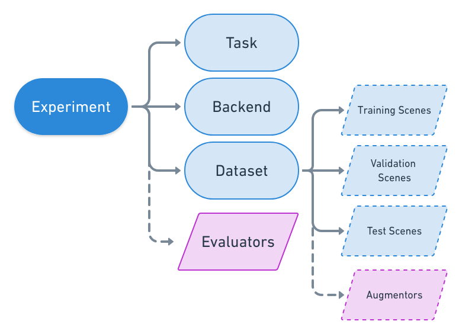
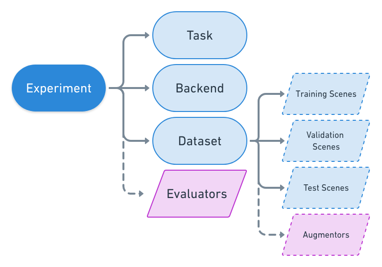

Experiment Configuration
========================

TKTK

Experiment Set
----------------

Experiment
----------

Task
----

Chip Classification
^^^^^^^^^^^^^^^^^^^

TKTK

Object Detection
^^^^^^^^^^^^^^^^

TKTK

Semantic Segmentation
^^^^^^^^^^^^^^^^^^^^^

TKTK

Future Tasks
^^^^^^^^^^^^

TKTK

Backend
-------

TKTK

Keras Classification
^^^^^^^^^^^^^^^^^^^^

TKTK

TensorFlow Object Detection
^^^^^^^^^^^^^^^^^^^^^^^^^^^

TKTK

TensorFlow DeepLab
^^^^^^^^^^^^^^^^^^

TKTK

Dataset
-------

TKTK

Scene
-----

Raster Source
^^^^^^^^^^^^^

TKTK

Ground Truth Label Source
^^^^^^^^^^^^^^^^^^^^^^^^^

TKTK

Prediction Label Store
^^^^^^^^^^^^^^^^^^^^^^

TKTK

Raster Transformers
^^^^^^^^^^^^^^^^^^^

TKTK

Augmentors
^^^^^^^^^^

TKTK
(Differentiate between RV Augmentation and Backend Augmentation)
