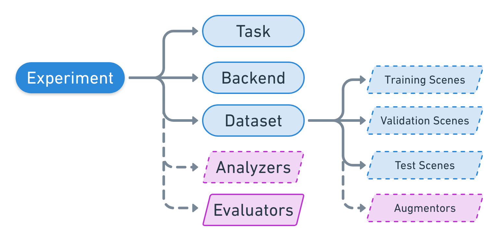
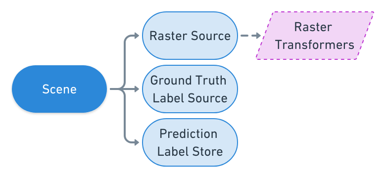

Experiment Configuration
========================

.. currentmodule:: rastervision

Experiments are configured programmatically using a compositional API based on the :ref:`builder pattern`.

.. _experiment set:

Experiment Set
--------------

An experiment set is a set of related experiments and can be created by subclassing ``ExperimentSet``. For each experiment, the class should have a method prefixed with ``exp_`` that returns either a single ``ExperimentConfig``, or
a list of ``ExperimentConfig`` objects. You can also return a ``CommandConfig`` directly or multiple in a list; this is useful when running :ref:`aux commands`.

In the ``tiny_spacenet.py`` example from the :ref:`quickstart`, the ``TinySpacenetExperimentSet`` is the ``ExperimentSet`` that Raster Vision finds when executing ``rastervision run -p tiny_spacenet.py``.

.. click:example::

   import rastervision as rv

   class TinySpacenetExperimentSet(rv.ExperimentSet):
       def exp_main(self):
           # Here we return an experiment or list of experiments
           pass

       # We could also add other experiment methods
       def exp_other_examples(self):
           pass

   if __name__ == '__main__':
       rv.main()

.. _experiment:

ExperimentConfig
----------------

An experiment is a sequence of commands that represents a machine learning workflow.
The way those workflows are configured is by constructing an ``ExperimentConfig``.
An ``ExperimentConfig`` is what is returned from the experiment methods of an ``ExperimentSet``,
and are used by Raster Vision to determine what and how :ref:`commands` will be run. While the
actual execution of the commands, be it locally or on AWS Batch, are determined by :ref:`experiment runner`,
all the details about how the commands will execute (which files, what methods, what hyperparameters, etc.)
are determined by the ``ExperimentConfig``.

The following diagram shows the hierarchy of the high level components that comprise an experiment configuration:

In the ``tiny_spacenet.py`` example, we can see that the experiment is the very last thing constructed
and returned.

.. code::

   experiment = rv.ExperimentConfig.builder() \
                                   .with_id('tiny-spacenet-experiment') \
                                   .with_root_uri('/opt/data/rv') \
                                   .with_task(task) \
                                   .with_backend(backend) \
                                   .with_dataset(dataset) \
                                   .with_stats_analyzer() \
                                   .build()

.. _task:

Task
----

A ``Task`` is a computer vision task such as chip classification, object detection, or semantic segmentation.
Tasks are configured using a ``TaskConfig``, which is then set into the experiment with the ``.with_task(task)`` method.

.. image:: _static/cv-tasks.png
    :align: center

Chip Classification
^^^^^^^^^^^^^^^^^^^^

*rv.CHIP_CLASSIFICATION*

In chip classification, the goal is to divide the scene up into a grid of cells and classify each cell. This task is good for getting a rough idea of where certain objects are located, or where indiscrete "stuff" (such as grass) is located. It requires relatively low labeling effort, but also produces spatially coarse predictions. In our experience, this task trains the fastest, and is easiest to configure to get "decent" results.

Object Detection
^^^^^^^^^^^^^^^^

*rv.OBJECT_DETECTION*

In object detection, the goal is to predict a bounding box and a class around each object of interest. This task requires higher labeling effort than chip classification, but has the ability to localize and individuate objects. Object detection models require more time to train and also struggle with objects that are very close together. In theory, it is straightforward to use object detection for counting objects.

Semantic Segmentation
^^^^^^^^^^^^^^^^^^^^^

*rv.SEMANTIC_SEGMENTATION*

In semantic segmentation, the goal is to predict the class of each pixel in a scene. This task requires the highest labeling effort, but also provides the most spatially precise predictions. Like object detection, these models take longer to train than chip classification models.

New Tasks
^^^^^^^^^^^^

It is possible to add support for new tasks by extending the Task class. Some potential tasks to add are chip regression (goal: predict a number for each chip) and instance segmentation (goal: predict a segmentation mask for each individual object).

TaskConfig
^^^^^^^^^^

A ``TaskConfig`` is always constructed through a builder, which is created by passing a **key** to the ``.builder`` static method of ``TaskConfig``. In our ``tiny_spacenet.py`` example, we configured a semantic segmentation task:

.. code::

    task = rv.TaskConfig.builder(rv.SEMANTIC_SEGMENTATION) \
                        .with_chip_size(300) \
                        .with_chip_options(chips_per_scene=50) \
                        .with_classes({
                            'building': (1, 'red')
                        }) \
                        .build()

.. seealso:: The :ref:`task api reference` API Reference docs have more information about the
             Task types available.

.. _backend:

Backend
-------

To avoid reinventing the wheel, Raster Vision relies on third-party libraries to implement core functionality around building and training models for the various computer vision tasks it supports.
To maintain flexibility and avoid being tied to any one library, Raster Vision tasks interact with other libraries via a "backend" interface `inspired by Keras <https://keras.io/backend/>`_.
Each backend is a subclass of ``Backend`` and mediates between Raster Vision data structures and another library.
Backends are configured using a ``BackendConfig, which is then set into the experiment using the ``.with_backend(backend)``.

We are in the process of sunsetting the Tensorflow-based backends in favor of backends based on PyTorch.

PyTorch Chip Classification
^^^^^^^^^^^^^^^^^^^^^^^^^^^^

*rv.PYTORCH_CHIP_CLASSIFICATION*

For chip classification, the default backend is PyTorch Chip Classification. It trains classification models from `torchvision <https://pytorch.org/docs/stable/torchvision/index.html>`_.

PyTorch Semantic Segmentation
^^^^^^^^^^^^^^^^^^^^^^^^^^^^^

*rv.PYTORCH_SEMANTIC_SEGMENTATION*

For semantic segmentation, the default backend is PyTorch Semantic Segmentation. It trains the DeepLabV3 model in `torchvision <https://pytorch.org/docs/stable/torchvision/index.html>`_.

PyTorch Object Detection
^^^^^^^^^^^^^^^^^^^^^^^^^^^^^

*rv.PYTORCH_OBJECT_DETECTION*

For object detection, the default backend is PyTorch Object Detection. It trains the Faster-RCNN model in `torchvision <https://pytorch.org/docs/stable/torchvision/index.html>`_.

TensorFlow Object Detection
^^^^^^^^^^^^^^^^^^^^^^^^^^^

*rv.TF_OBJECT_DETECTION*

For object detection, the default backend is the Tensorflow Object Detection API. It supports a variety of object detection architectures such as SSD, Faster-RCNN, and RetinaNet with Mobilenet, ResNet, and Inception as base models.

Keras Classification
^^^^^^^^^^^^^^^^^^^^

*rv.KERAS_CLASSIFICATION*

This backend uses Keras Classification, a small, simple interal library for image classification using Keras. Currently, it only has support for ResNet50.

TensorFlow DeepLab
^^^^^^^^^^^^^^^^^^

*rv.TF_DEEPLAB*

This backend has support for the Deeplab segmentation architecture with Mobilenet and Inception as base models.

.. note:: For each Tensorflow-based backend included with Raster Vision there is a list of  :ref:`model defaults` with a default configuration for each model architecture. Each default can be considered a good starting point for configuring that model.

BackendConfig
^^^^^^^^^^^^^

A ``BackendConfig`` is always constructed through a builder, which is created with a **key** using the ``.builder`` static method of ``BackendConfig``. In our ``tiny_spacenet.py`` example, we configured the PyTorch semantic segmentation backend:

.. code::

    backend = rv.BackendConfig.builder(rv.PYTORCH_SEMANTIC_SEGMENTATION) \
        .with_task(task) \
        .with_train_options(
            batch_size=2,
            num_epochs=1,
            debug=True) \
        .build()

.. seealso:: The :ref:`backend api reference` API Reference docs have more information about the
             Backend types available.

.. _dataset:

Dataset
-------

A ``Dataset`` contains the `training, validation, and test splits <https://en.wikipedia.org/wiki/Training,_test,_and_validation_sets>`_ needed to train and evaluate a model. Each dataset split is a list of scenes. A dataset can also hold an :ref:`augmentor`, which describes how to augment the training scenes (but not the validation and test scenes).

In our ``tiny_spacenet.py`` example, we configured the dataset with single scenes, though more often
in real use cases you would call ``with_train_scenes`` and ``with_validation_scenes`` with many scenes:

.. code::

   dataset = rv.DatasetConfig.builder() \
                             .with_train_scenes(train_scenes) \
                             .with_validation_scenes(val_scenes) \
                             .build()

.. _scene:

Scene
-----

A scene represents an image, associated labels, and an optional list of areas of interest (AOIs) that describes which parts of the scene have been exhaustively labeled. Labels are task-specific annotations, and can represent geometries (bounding boxes for object detection or chip classification), rasters (semantic segmentation), or even numerical values (for regression tasks, not yet implemented). Specifying an AOI allows Raster Vision to understand not only where it can pull "positive" chips from, or subsets of imagery that contain the target class we are trying to identify, but also lets Raster Vision know where it is able to pull "negative" examples, or subsets of imagery that are missing the target class.

A scene is composed of the following elements:

* *Image*: Represented in Raster Vision by a ``RasterSource``, a large scene image can contain multiple sub-images or a single file.
* *Labels*: Represented in Raster Vision as a ``LabelSource``, this is what provides the annotations or labels for the scene. The nature of the labels that are produced by the LabelSource are specific to the :ref:`task` that the machine learning model is performing.
* *AOIs* (Optional): An optional list of areas of interest that describes which sections of the scene image (RasterSource) are exhaustively labeled.

In addition to the outline above, which describes training data completely, a :ref:`label store` is also associated with scenes on which Raster Vision will perform prediction. The label store determines how to store and retrieve the predictions from a scene.

SceneConfig
^^^^^^^^^^^

A ``SceneConfig`` consists of a ``RasterSourceConfig`` optionally combined with a ``LabelSourceConfig``, ``LabelStoreConfig``, and list of AOIs. Each AOI is expected to be a URI to a GeoJSON file containing polygons.

In our ``tiny_spacenet.py`` example, we configured the train scene with a GeoTIFF URI and a GeoJSON URI.
We pass in a ``RasterSourceConfig`` object to the ``with_raster_source`` method, but just pass the URI to ``with_label_source``. This is because
the ``SceneConfig`` can construct a default ``LabelSourceConfig`` based on the URI using :ref:`default provider`. The ``LabelStoreConfig`` is not explicitly set in the building of the ``SceneConfig``. This is because
the prediction label store can be determined by :ref:`default provider` by finding the
default ``LabelStore`` provider for a given task.

.. code::

   train_scene =  rv.SceneConfig.builder() \
                                .with_task(task) \
                                .with_id('train_scene') \
                                .with_raster_source(train_raster_source) \
                                .with_label_source(train_label_uri) \
                                .build()

.. _raster source:

RasterSource
^^^^^^^^^^^^

A ``RasterSource`` represents a source of raster data for a scene, and has subclasses for various data sources. They are used to retrieve small windows of raster data from larger scenes. You can also set a subset of channels (i.e. bands) that you want to use and their order. For example, satellite imagery often contains more than three channels, but pretrained models trained on datasets like Imagenet only support three (RGB) input channels. In order to cope with this situation, we can select three of the channels to utilize.

Imagery
........

*rv.RASTERIO_SOURCE*

Any images that can be read by `GDAL/Rasterio <https://www.gdal.org/formats_list.html>`_ can be handled by the ``RasterioSource``. This includes georeferenced imagery such as GeoTIFFs. If there are multiple image files that cover a single scene, you can pass the corresponding list of URIs using ``with_uris()``, and read from the ``RasterSource`` as if it were a single stitched-together image.

The ``RasterioSource`` can also read non-georeferenced images such as ``.tif``, ``.png``, and ``.jpg`` files. This is useful for oblique drone imagery, biomedical imagery, and any other (potentially massive!) non-georeferenced images.

Rasterized Vectors
...................

*rv.RASTERIZED_SOURCE*

Semantic segmentation labels stored as polygons in a ``VectorSource`` can be rasterized and read using a ``RasterizedSource``. This is a slightly unusual use of a ``RasterSource`` as we're using it to read labels, and not images to use as input to a model.

RasterSourceConfig
...................

In the ``tiny_spacenet.py`` example, we build the training scene raster source:

.. code::

   train_raster_source = rv.RasterSourceConfig.builder(rv.RASTERIO_SOURCE) \
                                              .with_uri(train_image_uri) \
                                              .with_stats_transformer() \
                                              .build()

.. seealso:: The :ref:`raster source api reference` API Reference docs have more information about RasterSources.

.. _vector source:

VectorSource
^^^^^^^^^^^^

A ``VectorSource`` is an object that supports reading vector data like polygons and lines from various places. It is used by ``ObjectDetectionLabelSource`` and ``ChipClassificationLabelSource``, as well as the ``RasterizedSource`` (a type of ``RasterSource``).

VectorSourceConfig
...................

Here is an example of configuring a ``VectorTileVectorSource`` which uses Mapbox vector tiles as a source of labels. A complete example using this is in the `Spacenet Vegas example <https://github.com/azavea/raster-vision-examples/tree/0.11#spacenet-vegas-roads-and-buildings>`_.

.. code::

    uri = 'http://foo.com/{z}/{x}/{y}.mvt'
    class_id_to_filter = {1: ['has', 'building']}

    b = rv.VectorSource.builder(rv.VECTOR_TILE_SOURCE) \
        .with_class_inference(class_id_to_filter=class_id_to_filter,
                              default_class_id=None) \
        .with_uri(uri) \
        .with_zoom(14) \
        .build()

.. seealso:: The :ref:`vector source api reference` API Reference docs have more information about the ``VectorSource`` types available.

.. _label source:

LabelSource
^^^^^^^^^^^

A ``LabelSource`` is an object that allows reading ground truth labels for a scene. There are subclasses for different tasks and data formats. They can be queried for the labels that lie within a window and are used for creating training chips, as well as providing ground truth labels for evaluation against validation scenes.

Here is an example of configuring a ``SemanticSegmentationLabelSource`` using rasterized vector data.  A complete example using this is in the `Spacenet Vegas example <https://github.com/azavea/raster-vision-examples/blob/0.11/spacenet/vegas.py>`_.

.. code::

    label_raster_source = rv.RasterSourceConfig.builder(rv.RASTERIZED_SOURCE) \
        .with_vector_source(vector_source) \
        .with_rasterizer_options(background_class_id, line_buffer=line_buffer) \
        .build()

    label_source = rv.LabelSourceConfig.builder(rv.SEMANTIC_SEGMENTATION) \
        .with_raster_source(label_raster_source) \
        .build()

.. seealso:: The :ref:`label source api reference` API Reference docs have more information about the LabelSource types available.

.. _label store:

LabelStore
^^^^^^^^^^

A ``LabelStore`` is an object that allows reading and writing predicted labels for a scene. There are subclasses for different tasks and data formats. They are used for saving predictions and then loading them during evaluation.

In the ``tiny_spacenet.py`` example, there is no explicit ``LabelStore`` supplied on the validation scene. It instead relies on the :ref:`default provider` architecture to determine the correct label store to use. If we wanted to state the label store explicitly, the following code would be equivalent:

.. code::

   val_label_store = rv.LabelStoreConfing.builder(rv.OBJECT_DETECTION_GEOJSON) \
                                         .build()

   val_scene = rv.SceneConfig.builder() \
                             .with_task(task) \
                             .with_id('val_scene') \
                             .with_raster_source(val_raster_source) \
                             .with_label_source(val_label_uri) \
                             .with_label_store(val_label_store) \
                             .build()

Notice the above example does not set the explicit URI for where the ``LabelStore`` will store it's labels.
We could do that, but if we leave that out the Raster Vision logic will set that path explicitly
based on the exeriment's root directory and the predict command's key.

.. seealso:: The :ref:`label store api reference` API Reference docs have more information about the
             LabelStore types available.

.. _raster transformer:

Raster Transformers
^^^^^^^^^^^^^^^^^^^

A ``RasterTransformer`` is a mechanism for transforming raw raster data into a form that is more suitable for being fed into a model.

.. seealso:: The :ref:`raster transformer api reference` API Reference docs have more information about the
             RasterTransformer types available.

.. _augmentor:

Augmentors
^^^^^^^^^^

Data augmentation is a technique used to increase the effective size of a training dataset. It consists of transforming the images (and labels) using random shifts in position, rotation, zoom level, and color distribution. Each backend has its own ways of doing data augmentation inherited from its underlying third-party library, but some additional forms of data augmentation are implemented within Raster Vision as ``Augmentors``.
For instance, there is a ``NodataAugmentor`` which adds blocks of NODATA values to images to learn to avoid making spurious predictions over NODATA regions.

.. seealso:: The :ref:`augmentor api reference` API Reference docs have more information about the
             Augmentors available.

.. _analyzer:

Analyzers
---------

Analyzers are used to gather dataset-level statistics and metrics for use in downstream processes. Currently
the only analyzer available is the ``StatsAnalyzer``, which determines the distribution of values over
the imagery in order to normalize values to ``uint8`` values in a ``StatsTransformer``.

.. seealso:: The :ref:`analyzer api reference` API Reference docs have more information about the
             Analyzers available.

.. _evaluator:

Evaluators
----------

For each task, there is an evaluator that computes metrics for a trained model. It does this by measuring the discrepancy between ground truth and predicted labels for a set of validation scenes.

Normally you will not have to set any evaluators into the ``ExperimentConfig``, as the default
architecture will choose the evaluator that applies to the specific ``Task`` the experiment pertains to.

.. seealso:: The :ref:`evaluator api reference` API Reference docs have more information about the
             Evaluators available.

.. _default provider:

Default Providers
-----------------

Default Providers allow Raster Vision users to either state configuration simply, i.e. give a URI instead of a full configuration, or not at all. Defaults are provided for a number of configurations. There is also the
ability to add new defaults via the :ref:`plugins` architecture.

For instance, you can specify a RasterSource and LabelSource just by a URI, and the Defaults registered with the
:ref:`global registry` will find a default that pertains to that URI. There are default LabelStores and Evaluators
per Task, so you won't have to state them explicitly unless you need additional configuration or
are using a non-default type.
