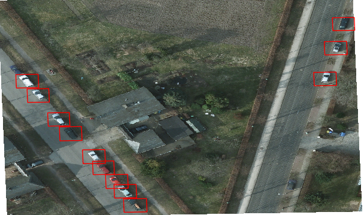

# Object Detection Tutorial

This tutorial introduces some Raster Vision concepts and demonstrates how to run an object detection workflow.

## Raster Vision concepts

### Commands

Raster Vision supports four *commands*.
* `process_training_data`: creates training chips from raster data and ground truth labels and converts them to backend-specific format
* `train`: trains a model
* `predict`: makes predictions on raster data using a model
* `eval`: evaluates the quality of the predictions against ground truth labels

### Config files
Each command is configured with a *command config* file in the form of a JSON-formatted [Protocol Buffer](https://developers.google.com/protocol-buffers/docs/pythontutorial), and there is a different schema for each command. The advantage of using protobufs (rather than conventional JSON files) is that we get compositional schemas, validation, and automatically generated Python clients for free. The schemas are stored in the `.proto` files in [rastervision.protos](../src/rastervision/protos), and are compiled to Python classes using `./scripts/compile`.

### Projects

Data is organized into a set of *training projects* and a set of *test projects*. Each training project consists of a *raster source* with imagery covering some area of interest, and a ground truth *label store* with labels generated by people. Each test project additionally contains a prediction label store where predictions are stored.

### Machine learning tasks and backends

A *machine learning task* implements functionality specific to an abstract prediction problem such as object detection. In contrast, a *machine learning backend* implements a bridge to a (usually third party) concrete implementation of that task, such as the [Tensorflow Object Detection API](https://github.com/tensorflow/models/tree/master/research/object_detection).

Raster Vision is designed to be easy to extend to new raster sources and label stores, and machine learning tasks and backends.

### Workflows

A *workflow* is a network of dependent commands. For instance, you might want to make two variants of a dataset, then train a set of model on each dataset (representing a hyperparameter sweep), make predictions for each model on a test set, and then evaluate the quality of the predictions. This workflow can be represented as a tree of commands. At the moment, we have only implemented a *chain workflow*, which has the structure of a linked list or chain, and simply runs the four commands in sequence. A workflow is configured by a *workflow config* file, and executing it generates a set of command config files. By decoupling command and workflow configs, Raster Vision is designed to make it easy to implement new, more complex workflows.

## File hierarchy

When using chain workflows, you will need to use the following file hierarchy convention for the output of Raster Vision since the workflow runner generates URIs according to this convention. However, if you would like to manually write configs and run commands outside of a workflow (for instance, when making new predictions for an existing model), then you do not need to follow any particular convention since absolute paths are used in the command config files.

```
# The root of the file hierarchy -- local or on S3
<RVROOT>
# Output of running Raster Vision
<RVROOT>/rv-output

# Output and config file for a run of compute_raster_stats command.
<RVROOT>/rv-output/raw-datasets/<RAW_DATASET_KEY>/output/
<RVROOT>/rv-output/raw-datasets/<RAW_DATASET_KEY>/config.json

# Output and config file for a run of process_training_data command
.../<RAW_DATASET_KEY>/datasets/<DATASET_KEY>/output/
.../<RAW_DATASET_KEY>/datasets/<DATASET_KEY>/config.json

# Output (and config file) for a run of train command
.../<DATASET_KEY>/models/<MODEL_KEY>/output/
.../<DATASET_KEY>/models/<MODEL_KEY>/config.json

# Output (and config file) for a run of predict command
.../<MODEL_KEY>/predictions/<PREDICTION_KEY>/output/
.../<MODEL_KEY>/predictions/<PREDICTION_KEY>/config.json

# Output (and config file) for a run of eval command
.../<PREDICTION_KEY>/evals/<EVAL_KEY>/output/
.../<PREDICTION_KEY>/evals/<EVAL_KEY>/config.json
```

This convention is convenient and intuitive because it stores the config file for a run of a command adjacent to its output, which makes it easy to reason about how output files were generated. It also nests models inside datasets, predictions inside models, and evals inside predictions, which mirrors the one-to-many relationship in arbitrary workflows between datasets and models, models and predictions, and predictions and evals. We also like to use the following convention for other files that are input to Raster Vision, but this isn't required.

```
# Pretrained model files provided by ML backend
<RVROOT>/pretrained-models
# Workflow config files
<RVROOT>/workflow-configs
# Config files in format specified by ML backend
<RVROOT>/backend-configs
# Data that is derivative of raw data
<RVROOT>/processed-data
```

## Running a test workflow locally

Before running the full workflow, you should check that the system is setup and running correctly by running a test workflow locally. This workflow uses a very tiny dataset so it will run quickly. First, you will need to copy files, edit configs, and run some commands.

* Copy the Mobilenet [model](http://download.tensorflow.org/models/object_detection/ssd_mobilenet_v1_coco_2017_11_17.tar.gz) that was pre-trained on COCO to `<RVROOT>/pretrained-models/tf-object-detection-api/ssd_mobilenet_v1_coco_2017_11_17.tar.gz`.
* Copy the [test backend config file](../src/rastervision/samples/backend-configs/tf-object-detection-api/mobilenet-test.config) to `<RVROOT>/backend-configs/tf-object-detection-api/mobilenet-test.config`.
* Copy the [test data](https://github.com/azavea/raster-vision-data/releases/download/v0.0.1/cowc-potsdam-test.zip) and unzip it to `<RVROOT>/processed-data/cowc-potsdam-test`.
* Copy the [test workflow config file](../src/rastervision/samples/workflow-configs/object-detection/cowc-potsdam-test.json) to `<RVROOT>/workflow-configs/object-detection/cowc-potsdam-test.json`.
* The workflow configs contain URI schemas which are strings containing parameters (eg. `{rv_root}`) which are expanded into absolute URIs when the workflow is executed. The `local_uri_map` and `remote_uri_map` fields define the value of the parameters for the two execution environments. This makes it easy to switch between local and remote execution. You will need to update the values of these maps for your own environment. (If you are at Azavea, you should create a new S3 bucket `raster-vision-<your initials>-dev` and use that in the `remote_uri_map`).
* Run the Docker container locally using `./scripts/run --cpu`.
* Compile the files in `src/rastervision/protos/*.proto` into Python files by running `./scripts/compile`.

If you run the workflow straight through, the predictions will be generated using a model that was only trained for a single step. Of course, the predictions will not be good, so you should run the workflow in two stages. In the first stage, you will run `compute_raster_stats`, `process_training_data` and `train`. In the second stage, you will swap in a model that has already been trained on cars, and run `predict` and `eval`.

You can run the first stage of the workflow using
```
python -m rastervision.utils.chain_workflow \
    <RVROOT>/workflow-configs/object-detection/cowc-potsdam-test.json \
    compute_raster_stats process_training_data train \
    --run
```
This should result in a hierarchy of files in `<RVROOT>/rv-output` which includes the generated config files. You should check that the training chips were generated correctly by unzipping `<RVROOT>/rv-output/raw-datatsets/<RAW_DATASET_KEY>/datasets/<DATASET_KEY>/output/train-debug-chips.zip` and spot checking some of the debug chips. Below is a sample debug chip. The second half of the chips are negative chips that contain no objects. *If the training chips are generated incorrectly, the rest of the workflow will be corrupted.*


Now, download the [trained car model](https://github.com/azavea/raster-vision-data/releases/download/v0.0.1/cowc-potsdam-model.zip), unzip it, and place the `model` file in `<RVROOT>/rv-output/raw-datasets/<RAW_DATASET_KEY>/datasets/<DATASET_KEY>/models/<MODEL_KEY>/output/`, replacing the file that is already there. Then run
```
python -m rastervision.utils.chain_workflow \
    <RVROOT>/workflow-configs/object-detection/cowc-potsdam-test.json \
    predict eval \
    --run
```
You should view the predictions in QGIS and check that it looks something like the following. The predictions are at `<RVROOT>/rv-output/raw-datasets/<RAW_DATASET_KEY>/datasets/<DATASET_KEY>/models/<MODEL_KEY>/predictions/<PREDICTION_KEY>/output/2-13.json` and the corresponding imagery should be at `<RVROOT>/processed-data/cowc-potsdam-test/2-13.tif`. If the raster layer looks washed out, you will need to turn the alpha channel off in the layer's Properties in QGIS.



## Making predictions on new imagery

A common use case is to train a model as part of a workflow, and then run `predict` on that model for some new imagery. Assuming that a chain workflow was run successfully, producing the usual output rooted at `<RVROOT>/rv-output`, here are the steps to do this.

* Copy the existing prediction config file at `<RVROOT>/rv-output/raw-datasets/<RAW_DATASET_KEY>/datasets/<DATASET_KEY>/models/<MODEL_KEY>/predictions/<PREDICTION_KEY>/config.json` to `<RVROOT>/rv-output/raw-datasets/<RAW_DATASET_KEY>/datasets/<DATASET_KEY>/models/<MODEL_KEY>/predictions/<NEW_PREDICTION_KEY>/config.json`. Note the `<NEW_PREDICTION_KEY>` in the path of the copied file.
* Edit the `projects` field in the new config file so that it references the  RasterSource and LabelSource for the new imagery.
* Run the predict command with the new config file. In this case the command would be
```
python -m rastervision.run predict \
    <RVROOT>/rv-output/datasets/<DATASET_KEY>/models/<MODEL_KEY>/predictions/<NEW_PREDICTION_KEY>/config.json
```
* The predictions will be in `<RVROOT>/rv-output/raw-datasets/<RAW_DATASET_KEY>/datasets/<DATASET_KEY>/models/<MODEL_KEY>/predictions/<NEW_PREDICTION_KEY>/output`

It's also possible to make predictions outside of a workflow entirely. The `predict` config file just references a model file -- it could be located anywhere.

## Run full workflow remotely

If running the test locally was successful, you can run the full workflow remotely. First, you will need to copy some data and edit some configs.

* Download the [ISPRS Potsdam](http://www2.isprs.org/commissions/comm3/wg4/2d-sem-label-potsdam.html) imagery using the [data request form](http://www2.isprs.org/commissions/comm3/wg4/data-request-form2.html) and place it in `<RVROOT>/raw-data/isprs-potsdam`.
* Copy the [cowc-potsdam labels](https://github.com/azavea/raster-vision-data/releases/download/v0.0.1/cowc-potsdam-labels.zip), unzip, and place the files in `<RVROOT>/processed-data/cowc-potsdam/labels/`. These files were generated from the [COWC car detection dataset](https://gdo152.llnl.gov/cowc/) using scripts in [rastervision.utils.cowc](../src/rastervision/utils/cowc/).
* Copy the [backend config](../src/rastervision/samples/backend-configs/tf-object-detection-api/mobilenet.config) to `<RVROOT>/backend-configs/tf-object-detection-api/mobilenet.config`.
* Copy the [workflow config](../src/rastervision/samples/workflow-configs/object-detection/cowc-potsdam.json)
to `<RVROOT>/workflow-configs/object-detection/cowc-potsdam.json`

Since it will take a long time to run the full workflow, it probably makes sense to run it remotely on AWS Batch. Before doing so, make sure all data and config files are copied to the right locations (as defined by the `remote_uri_map` field in the workflow config) on S3. Then run
```
python -m rastervision.utils.chain_workflow \
    <RVROOT>/workflow-configs/object-detection/cowc-potsdam.json \
    --run --remote --branch <REMOTE_GIT_BRANCH>
```
While the `train` command is running, you can view Tensorboard at `http://<ec2_public_dns>:6006`.

If you don't use AWS and have a local GPU, you can start the GPU container and run it locally with
```
./scripts/run --gpu
python -m rastervision.utils.chain_workflow \
    <RVROOT>/workflow-configs/object-detection/cowc-potsdam.json \
    --run
```

Running the workflow on AWS Batch (using C4 for CPU and P2 for GPU jobs) should take around 12 hours. In the output file generated by the `eval` command, the F1 score should be around 0.85 and the predictions (visualized in QGIS) should look something like this. These results were obtained from training with 1500 labeled car instances for 150,000 steps. It's very likely that better results can be obtained with fewer steps -- more experimentation is needed.


