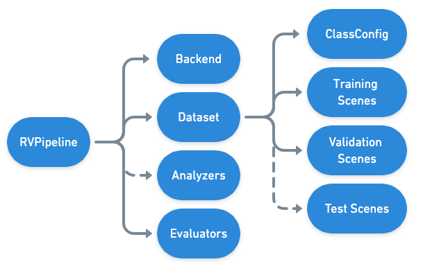
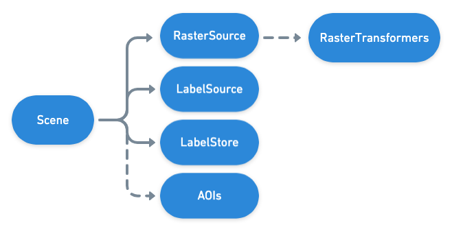

.. _rv pipelines:

Pipelines and Commands
========================

In addition to providing abstract :ref:`pipeline <pipelines>` functionality, Raster Vision provides a set of concrete pipelines for deep learning on remote sensing imagery including ``ChipClassification``, ``SemanticSegmentation``, and ``ObjectDetection``. These pipelines all derive from ``RVPipeline``, and are provided by the ``rastervision.core`` package. It's possible to customize these pipelines as well as create new ones from scratch, which is discussed in :ref:`customizing rv`.

.. image:: img/cv-tasks.png
    :align: center

Chip Classification
--------------------

In chip classification, the goal is to divide the scene up into a grid of cells and classify each cell. This task is good for getting a rough idea of where certain objects are located, or where indiscrete "stuff" (such as grass) is located. It requires relatively low labeling effort, but also produces spatially coarse predictions. In our experience, this task trains the fastest, and is easiest to configure to get "decent" results.

Object Detection
-----------------

In object detection, the goal is to predict a bounding box and a class around each object of interest. This task requires higher labeling effort than chip classification, but has the ability to localize and individuate objects. Object detection models require more time to train and also struggle with objects that are very close together. In theory, it is straightforward to use object detection for counting objects.

Semantic Segmentation
-----------------------

In semantic segmentation, the goal is to predict the class of each pixel in a scene. This task requires the highest labeling effort, but also provides the most spatially precise predictions. Like object detection, these models take longer to train than chip classification models.

Configuring RVPipelines
-------------------------

Each (subclass of) ``RVPipeline`` is configured by returning an instance of (a subclass of) ``RVPipelineConfig`` from a ``get_config()`` function in a Python module. It's also possible to return a list of ``RVPipelineConfigs`` from ``get_configs()``, which will be executed in parallel.

Each ``RVPipelineConfig`` object specifies the details about how the commands within the pipeline will execute (ie. which files, what methods, what hyperparameters, etc.). In contrast, the :ref:`pipeline runner <runners>`, which actually executes the commands in the pipeline, is specified as an argument to the :ref:`cli`. The following diagram shows the hierarchy of the high level components comprising an ``RVPipeline``:

In the ``tiny_spacenet.py`` example, the ``SemanticSegmentationConfig`` is the last thing constructed and returned from the ``get_config`` function.

.. code-block:: python

    chip_sz = 300

    chip_options = SemanticSegmentationChipOptions(
        window_method=SemanticSegmentationWindowMethod.random_sample,
        chips_per_scene=10)

    return SemanticSegmentationConfig(
        root_uri=root_uri,
        dataset=dataset,
        backend=backend,
        train_chip_sz=chip_sz,
        predict_chip_sz=chip_sz,
        chip_options=chip_options)

.. seealso:: The :ref:`api ChipClassificationConfig`, :ref:`api ObjectDetectionConfig`, and :ref:`api SemanticSegmentationConfig` API docs have more information on configuring pipelines.

Commands
---------

The ``RVPipelines`` provide a sequence of commands, which are described below.

.. image:: img/rv-pipeline-overview.png
    :align: center

ANALYZE
^^^^^^^

The ANALYZE command is used to analyze scenes that are part of an experiment and produce some output that can be consumed by later commands. Geospatial raster sources such as GeoTIFFs often contain 16- and 32-bit pixel color values, but many deep learning libraries expect 8-bit values. In order to perform this transformation, we need to know the distribution of pixel values. So one usage of the ANALYZE command is to compute statistics of the raster sources and save them to a JSON file which is later used by the StatsTransformer (one of the available :ref:`raster transformer`) to do the conversion.

.. _chip command:

CHIP
^^^^

Scenes are comprised of large geospatial raster sources (e.g. GeoTIFFs) and geospatial label sources (e.g. GeoJSONs), but models can only consume small images (i.e. chips) and labels in pixel based-coordinates. In addition, each :ref:`backend` has its own dataset format. The CHIP command solves this problem by converting scenes into training chips and into a format the backend can use for training.

TRAIN
^^^^^

The TRAIN command is used to train a model using the dataset generated by the CHIP command. The command uses the :ref:`backend` to run a training loop that saves the model and other artifacts each epoch. If the training command is interrupted, it will resume at the last epoch when restarted.

.. _predict command:

PREDICT
^^^^^^^

The PREDICT command makes predictions for a set of scenes using a model produced by the TRAIN command. To do this, a sliding window is used to feed small images into the model, and the predictions are transformed from image-centric, pixel-based coordinates into scene-centric, map-based coordinates.

EVAL
^^^^

The EVAL command evaluates the quality of models by comparing the predictions generated by the PREDICT command to ground truth labels. A variety of metrics including F1, precision, and recall are computed for each class (as well as overall) and are written to a JSON file.

.. _bundle command:

BUNDLE
^^^^^^

The BUNDLE command generates a model bundle from the output of the previous commands which contains a model file plus associated configuration data. A model bundle can be used to make predictions on new imagery using the :ref:`predict cli command` command.

.. _backend:

Backend
--------

The collection of ``RVPipelines`` use a "backend" abstraction inspired by `Keras <https://keras.io/backend/>`_, which makes it easier to customize the code for building and training models (including using Raster Vision with arbitrary deep learning libraries).
Each backend is a subclass of ``Backend`` and has methods for saving training chips, training models, and making predictions, and is configured with a ``BackendConfig``.

The ``rastervision.pytorch_backend`` plugin provides backends that are thin wrappers around the ``rastervision.pytorch_learner`` package, which does most of the heavy lifting of building and training models using ``torch`` and ``torchvision``. (Note that ``rastervision.pytorch_learner`` is decoupled from ``rastervision.pytorch_backend`` so that it can be used in conjunction with ``rastervision.pipeline`` to write arbitrary computer vision pipelines that have nothing to do with remote sensing.)

Here are the PyTorch backends:

* The ``PyTorchChipClassification`` backend trains classification models from `torchvision <https://pytorch.org/docs/stable/torchvision/index.html>`_.
* The ``PyTorchObjectDetection`` backend trains the Faster-RCNN model in `torchvision <https://pytorch.org/docs/stable/torchvision/index.html>`_.
* The ``PyTorchSemanticSegmentation`` backend trains the DeepLabV3 model in `torchvision <https://pytorch.org/docs/stable/torchvision/index.html>`_.

In our ``tiny_spacenet.py`` example, we configured the PyTorch semantic segmentation backend using:

.. code-block:: python

    backend = PyTorchSemanticSegmentationConfig(
        model=SemanticSegmentationModelConfig(backbone=Backbone.resnet50),
        solver=SolverConfig(lr=1e-4, num_epochs=1, batch_sz=2))

.. seealso:: The :ref:`api rastervision.pytorch_backend` and :ref:`api rastervision.pytorch_learner` API docs have more information on configuring backends.

.. _dataset:

Dataset
--------

A ``Dataset`` contains the `training, validation, and test splits <https://en.wikipedia.org/wiki/Training,_test,_and_validation_sets>`_ needed to train and evaluate a model. Each dataset split is a list of ``Scenes``.

In our ``tiny_spacenet.py`` example, we configured the dataset with single scenes, though more often in real use cases you would use multiple scenes per split:

.. code-block:: python

    dataset = DatasetConfig(
        class_config=class_config,
        train_scenes=[
            make_scene('scene_205', train_image_uri, train_label_uri)
        ],
        validation_scenes=[
            make_scene('scene_25', val_image_uri, val_label_uri)
        ])

.. seealso:: The :ref:`api DatasetConfig` API docs.

.. _scene:

Scene
-------

A scene is composed of the following elements:

* *Imagery*: a :ref:`raster source` represents a large scene image, which can be made up of multiple sub-images or a single file.
* *Ground truth labels*: a :ref:`label source` represents ground-truth task-specific labels.
* *Predicted labels*: a :ref:`label store` determines how to store and retrieve the predictions from a scene.
* *AOIs* (Optional): An optional list of areas of interest that describes which sections of the scene imagery are exhaustively labeled. It is important to only create training chips from parts of the scenes that have been exhaustively labeled -- in other words, that have no missing labels.

In our ``tiny_spacenet.py`` example, we configured the one training scene with a GeoTIFF URI and a GeoJSON URI.

.. code-block:: python

    def make_scene(scene_id, image_uri, label_uri):
        """
        - StatsTransformer is used to convert uint16 values to uint8.
        - The GeoJSON does not have a class_id property for each geom,
        so it is inferred as 0 (ie. building) because the default_class_id
        is set to 0.
        - The labels are in the form of GeoJSON which needs to be rasterized
        to use as label for semantic segmentation, so we use a RasterizedSource.
        - The rasterizer set the background (as opposed to foreground) pixels
        to 1 because background_class_id is set to 1.
        """
        raster_source = RasterioSourceConfig(
            uris=[image_uri],
            channel_order=channel_order,
            transformers=[StatsTransformerConfig()])

        label_source = SemanticSegmentationLabelSourceConfig(
            raster_source=RasterizedSourceConfig(
                vector_source=GeoJSONVectorSourceConfig(
                    uri=label_uri, default_class_id=0, ignore_crs_field=True),
                rasterizer_config=RasterizerConfig(background_class_id=1)))

        return SceneConfig(
            id=scene_id,
            raster_source=raster_source,
            label_source=label_source)

.. seealso:: The :ref:`api SceneConfig` API docs.

.. _raster source:

RasterSource
------------

A ``RasterSource`` represents a source of raster data for a scene, and has subclasses for various data sources. They are used to retrieve small windows of raster data from larger scenes. You can also set a subset of channels (i.e. bands) that you want to use and their order. For example, satellite imagery often contains more than three channels, but pretrained models trained on datasets like Imagenet only support three (RGB) input channels. In order to cope with this situation, we can select three of the channels to utilize.

RasterioSource
^^^^^^^^^^^^^^^

Any images that can be read by `GDAL/Rasterio <https://www.gdal.org/formats_list.html>`_ can be handled by the ``RasterioSource``. This includes georeferenced imagery such as GeoTIFFs. If there are multiple image files that cover a single scene, you can pass the corresponding list of URIs, and read from the ``RasterSource`` as if it were a single stitched-together image.

The ``RasterioSource`` can also read non-georeferenced images such as ``.tif``, ``.png``, and ``.jpg`` files. This is useful for oblique drone imagery, biomedical imagery, and any other (potentially massive!) non-georeferenced images.

RasterizedSource
^^^^^^^^^^^^^^^^^

Semantic segmentation labels stored as polygons in a ``VectorSource`` can be rasterized and read using a ``RasterizedSource``. This is a slightly unusual use of a ``RasterSource`` as we're using it to read labels, and not images to use as input to a model.

.. seealso:: The :ref:`api RasterioSourceConfig` and :ref:`api RasterizedSourceConfig` API docs.

.. _raster transformer:

RasterTransformer
---------------------

A ``RasterTransformer`` is a mechanism for transforming raw raster data into a form that is more suitable for being fed into a model.

StatsTransformer
^^^^^^^^^^^^^^^^^^

This transformer is used to convert non-uint8 values to uint8 using statistics computed by the :ref:`stats analyzer`.

.. seealso:: The :ref:`api StatsTransformerConfig` API docs.

VectorSource
---------------

A ``VectorSource`` supports reading vector data like polygons and lines from various places. It is used by ``ObjectDetectionLabelSource`` and ``ChipClassificationLabelSource``, as well as the ``RasterizedSource`` (a type of ``RasterSource``).

GeoJSONVectorSource
^^^^^^^^^^^^^^^^^^^^

This vector source reads GeoJSON files.

.. seealso:: The :ref:`api GeoJSONVectorSourceConfig` API docs.

.. _label source:

LabelSource
------------

A ``LabelSource`` supports reading ground truth labels for a scene in the form of vectors or rasters.
There are subclasses for different tasks and data formats. They can be queried for the labels that lie within a window and are used for creating training chips, as well as providing ground truth labels for evaluation against validation scenes.

.. seealso:: The :ref:`api ChipClassificationLabelSourceConfig`, :ref:`api SemanticSegmentationLabelSourceConfig`, and :ref:`api ObjectDetectionLabelSourceConfig` API docs.

.. _label store:

LabelStore
^^^^^^^^^^

A ``LabelStore`` supports reading and writing predicted labels for a scene. There are subclasses for different tasks and data formats. They are used for saving predictions and then loading them during evaluation.

In the ``tiny_spacenet.py`` example, there is no explicit ``LabelStore`` configured on the validation scene, because it can be inferred from the type of ``RVPipelineConfig`` it is part of.
In the ISPRS Potsdam example, the following code is used to explicitly create a ``LabelStore`` that writes out the predictions in "RGB" format, where the color of each pixel represents the class, and predictions of class 0 (ie. car) are also written out as polygons.

.. code-block:: python

    label_store = SemanticSegmentationLabelStoreConfig(
        rgb=True, vector_output=[PolygonVectorOutputConfig(class_id=0)])

    scene = SceneConfig(
        id=id,
        raster_source=raster_source,
        label_source=label_source,
        label_store=label_store)

.. seealso:: The :ref:`api ChipClassificationGeoJSONStoreConfig`, :ref:`api SemanticSegmentationLabelStoreConfig`, and :ref:`api ObjectDetectionGeoJSONStoreConfig` API docs.

.. _analyzer:

Analyzers
---------

Analyzers are used to gather dataset-level statistics and metrics for use in downstream processes. Typically, you won't need to explicitly configure any.

.. _stats analyzer:

StatsAnalyzer
^^^^^^^^^^^^^^

Currently the only analyzer available is the ``StatsAnalyzer``, which determines the distribution of values over the imagery in order to normalize values to ``uint8`` values in a ``StatsTransformer``.

.. _evaluator:

Evaluators
----------

For each computer vision task, there is an evaluator that computes metrics for a trained model. It does this by measuring the discrepancy between ground truth and predicted labels for a set of validation scenes. Typically, you won't need to explicitly configure any.
