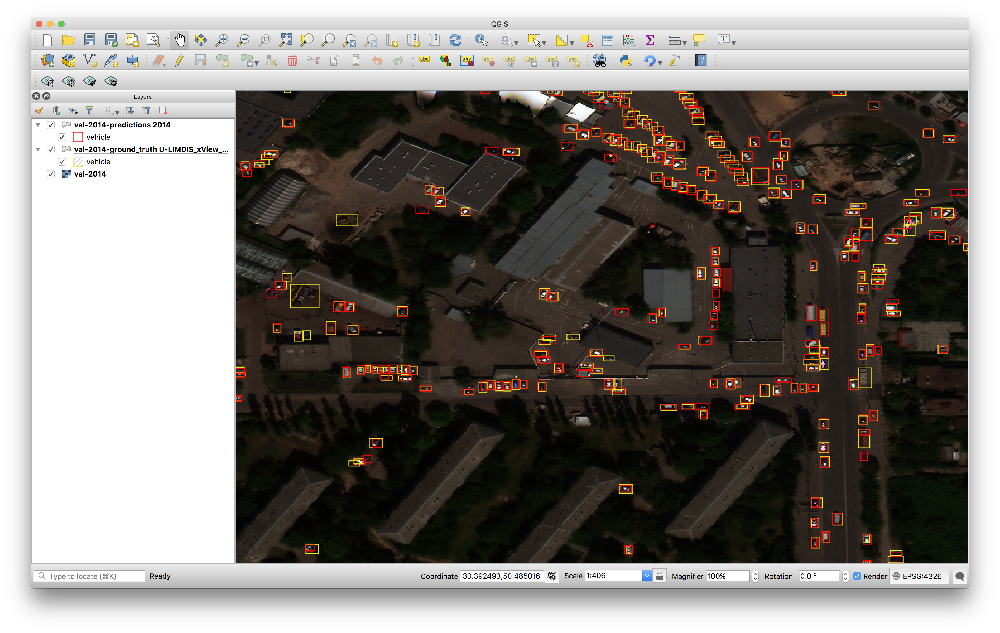
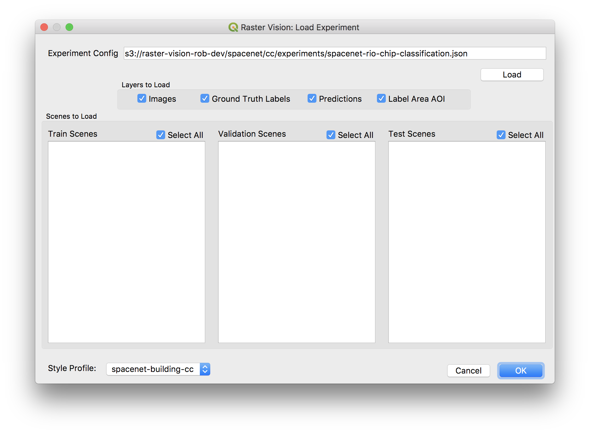
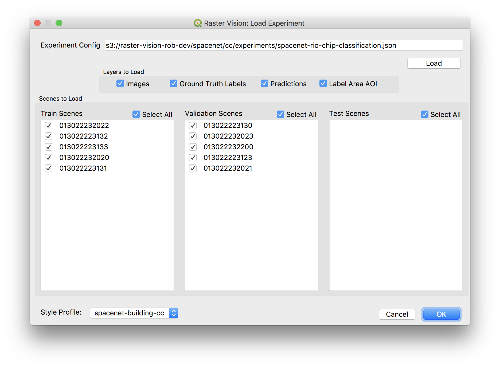
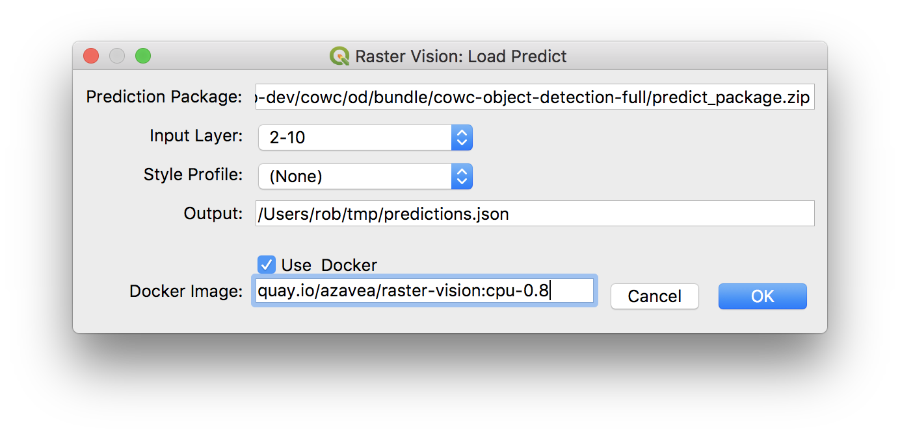
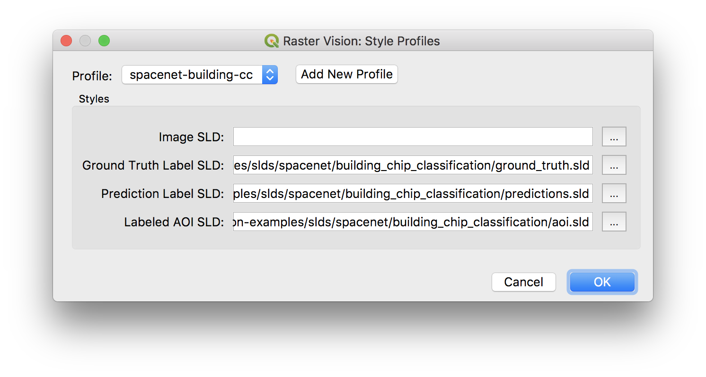
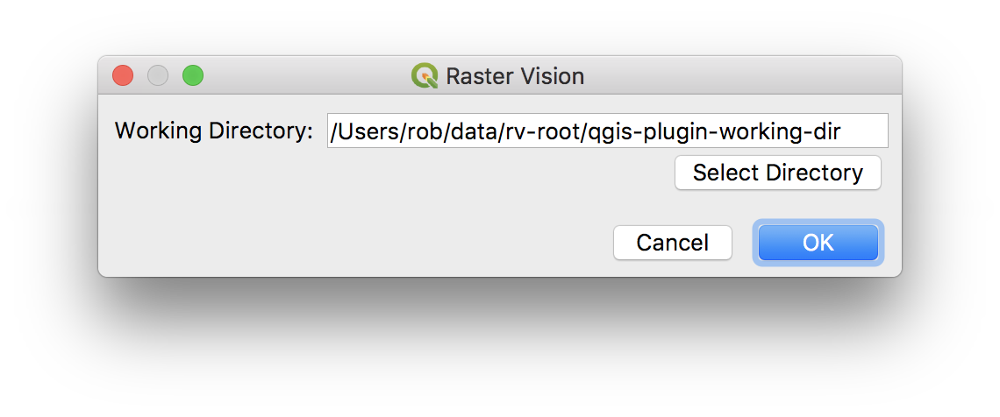

QGIS Plugin
===========

The Raster Vision QGIS plugin allows Raster Vision users to quickly view the results of experiments run against
geospatial imagery. It also lets you run predictions inside of QGIS using the :ref:`predict package` of trained
models.

Installing
----------

To install the QGIS Plugin, you must have ``rastervision`` installed in the Python 3 environment that is running QGIS. Don't worry, you won't have to install all of the deep learning frameworks just to use the plugin - you can just ``pip install rastervision`` (or ``pip3 install rastervision`` if Python 3 is not the default on your system). This has been tested with Python 3.6 and QGIS 3.2.

Installing from Plugin Manager
^^^^^^^^^^^^^^^^^^^^^^^^^^^^^^

A package containing all the needed dependencies can be installed through QGIS Plugin Manager.
To install from plugin manager:

Click the menu "Plugins" -> "Manage and Install Plugins".
Enter 'Raster Vision' in search box. After installation is complete, there should be a "Raster Vision" submenu under the "Plugins" menu.

Installing from release
^^^^^^^^^^^^^^^^^^^^^^^

To install, grab the release `.tar.gz` file from the `GitHub Releases <https://github.com/azavea/raster-vision-qgis/releases>`_ page. Extract this into your QGIS Plugins directory, then restart QGIS and activate the plugin through QGIS menu ("Plugins" -> "Manage and Install Plugins"). You can use a command like:

.. code-block:: console

   tar -xvf rastervision_qgis-v0.8.0.tar.gz -C ${QGIS_PLUGIN_DIRECTORY}

Where ``${QGIS_PLUGIN_DIRECTORY}`` is your QGIS plugin directory. See this `GIS StackExchange post <https://gis.stackexchange.com/questions/274311/qgis-3-plugin-folder-location>`_ if you need help finding your plugin directory.

QGIS Environment Setup
^^^^^^^^^^^^^^^^^^^^^^

.. note:: QGIS environment variables are distinct from Bash environment variables, and can be set by going to "QGIS3" -> "Preferences" -> "System" -> "Environment" in the menu and then restarting QGIS.

Using with AWS
~~~~~~~~~~~~~~

To use the plugin with files stored on AWS S3, you will need to have ``boto3`` installed, which can be done with ``pip install boto3``. You'll also need to set an ``AWS_PROFILE`` environment variable in QGIS if you're not using the default AWS profile.

Using with Docker
~~~~~~~~~~~~~~~~~

To run predict through Docker, make sure that the Docker command is on the ``PATH`` environment variable used by QGIS.

|experiment icon| Load Experiment
---------------------------------

The ``Load Experiment`` Dialog of the plugin lets you load results from an experiment.

The first step in using this feature is to load up an experiment configuration JSON file. You can find
experiment configurations in the ``experiments`` directory under the ``root_uri`` of your
experiment.

After hitting the *Load* button, you should see the dialog populate with the train, validation, and test scenes
that were used in the experiment. The names that appear in the dialog are the scene's ID.

You can select which data type you want form each scene in the "Layers to Load" section. You can also select Scenes that you want to load from the list boxes.

You can choose one of your configued :ref:`qgis style profile` from the "Style Profile" box. All incoming layers will be styled according to the style profile.

When you're satisfied with your choices, pressing OK and the project will load in QGIS. This will clear the current project in QGIS and load the new layers - if you already have layers, it will confirm that you want to clear out your project.

The layers that load will have the following naming conventions:

* ``train-*`` layers are from train scenes.
* ``val-*`` layers are from validation scenes.
* ``test-*`` layers are from test scenes.
* Everything will include the scene ID
* Ground truth labels are suffixed with ``-ground_truth``
* Predictions are suffixed with ``-predictions``

|predict  icon| Predict
-----------------------

This Dialog allows you to make predictions using a :ref:`predict package` from a raster vision experiment.

To use do the following:

* input the predict package URI
* select a layer from the "Input Layer" dropdown, which is populated from the raster layers of the current QGIS project
* Optionally choose a Style Profile
* Select whether or not to update any stats used by the model with the given image
* Give the path where the prediction labels should be saved to

You can use Docker or a local installation of Raster Vision to run the prediction. If using Docker, you'll have to give the name of the image from which to run the container.

This runs a similar process as the :ref:`predict cli command` CLI command, and will load the prediciton layer after prediction completes.

.. _qgis style profile:

|style profiles icon| Style Profiles
------------------------------------

Set up style profiles so that when you load an experiment or make predictions,
layers are automatically styled with given SLDs or QML files.

The best way to do this is to styl each of the types of layers you want after first loading an experiment. Export an SLD or QML of the style for each layer by using the `Style` -> `Save Style` command in the `Symbology` section of the layer properties. Then, create a style profile for that experiment group, and point it to the appropriate QML or SLD files. Now you'll be able to select the style profile when loading new experiments and making predictions.

|configure icon| Configure
--------------------------

Configure the plugin with a working directory.  If the files live on S3, this plugin will download files as necessary to your local working directory. If the file already exists in the working directory, the plugin will check the timestamps and overwrite the local file if the file on S3 is newer.
