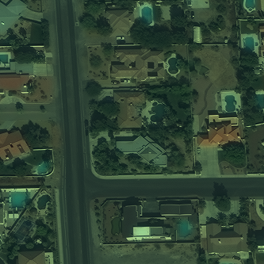
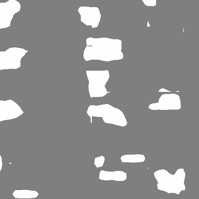

.. _quickstart:

Quickstart
==========

In this Quickstart, we'll train a semantic segmentation model on `SpaceNet <https://spacenetchallenge.github.io/datasets/datasetHomePage.html>`_ data. Don't get too excited - we'll only be training for a very short time on a very small training set! So the model that is created here will be pretty much worthless. But! These steps will show how Raster Vision pipelines are set up and run, so when you are ready to run against a lot of training data for a longer time on a GPU, you'll know what you have to do. Also, we'll show how to make predictions on the data using a model we've already trained on GPUs to show what you can expect to get out of Raster Vision.

For the Quickstart we are going to be using one of the published :ref:`docker images`
as it has an environment with all necessary dependencies already installed.

.. seealso:: It is also possible to install Raster Vision using ``pip``, but it can be time-consuming and error-prone to install all the necessary dependencies. See :ref:`install raster vision` for more details.

.. note:: This Quickstart requires a Docker installation. We have tested this with Docker 19, although you may be able to use a lower version. See `Get Started with Docker <https://www.docker.com/get-started>`_ for installation instructions.

You'll need to choose two directories, one for keeping your configuration source file and another for
holding experiment output. Make sure these directories exist:

.. code-block:: terminal

   > export RV_QUICKSTART_CODE_DIR=`pwd`/code
   > export RV_QUICKSTART_OUT_DIR=`pwd`/output
   > mkdir -p ${RV_QUICKSTART_CODE_DIR} ${RV_QUICKSTART_OUT_DIR}

Now we can run a console in the the Docker container by doing

.. code-block:: terminal

   > docker run --rm -it \
        -v ${RV_QUICKSTART_CODE_DIR}:/opt/src/code  \
        -v ${RV_QUICKSTART_OUT_DIR}:/opt/data/output \
        quay.io/azavea/raster-vision:pytorch-0.12 /bin/bash

.. seealso:: See :ref:`docker images` for more information about setting up Raster Vision with Docker images.

The Data
--------

.. raw:: html

         

             <iframe src="_static/tiny-spacenet-map.html" frameborder="0" allowfullscreen style="position: absolute; top: 0; left: 0; width: 100%; height: 100%;"></iframe>
         

Configuring a semantic segmentation pipeline
----------------------------------------------

Create a Python file in the ``${RV_QUICKSTART_CODE_DIR}`` named ``tiny_spacenet.py``. Inside, you're going to write a function called ``get_config`` that returns a ``SemanticSegmentationConfig`` object. This object's type is a subclass of ``PipelineConfig``, and configures a semantic segmentation pipeline which analyzes the imagery, creates training chips, trains a model, makes predictions on validation scenes, evaluates the predictions, and saves a model bundle.

.. literalinclude:: ../rastervision_pytorch_backend/rastervision/pytorch_backend/examples/tiny_spacenet.py
   :language: python
   :caption: tiny_spacenet.py

Running the pipeline
---------------------

We can now run the pipeline by invoking the following command inside the container.

.. code-block:: terminal

   > rastervision run local code/tiny_spacenet.py

Seeing Results
---------------

If you go to ``${RV_QUICKSTART_OUT_DIR}`` you should see a directory structure like this.

.. note:: This uses the ``tree`` command which you may need to install first.

.. code-block:: terminal

   > tree -L 3
    .
    ├── analyze
    │   └── stats.json
    ├── bundle
    │   └── model-bundle.zip
    ├── chip
    │   └── 3113ff8c-5c49-4d3c-8ca3-44d412968108.zip
    ├── eval
    │   └── eval.json
    ├── pipeline-config.json
    ├── predict
    │   └── scene_25.tif
    └── train
        ├── dataloaders
        │   ├── test.png
        │   ├── train.png
        │   └── valid.png
        ├── last-model.pth
        ├── learner-config.json
        ├── log.csv
        ├── model-bundle.zip
        ├── tb-logs
        │   └── events.out.tfevents.1585513048.086fdd4c5530.214.0
        ├── test_metrics.json
        └── test_preds.png

The root directory contains a serialized JSON version of the configuration at ``pipeline-config.json``, and each subdirectory with a command name contains output for that command. You can see test predictions on a batch of data in ``train/test_preds.png``, and evaluation metrics in ``eval/eval.json``, but don't get too excited! We
trained a model for 1 epoch on a tiny dataset, and the model is likely making random predictions at this point. We would need to
train on a lot more data for a lot longer for the model to become good at this task.

Model Bundles
----------------

To immediately use Raster Vision with a fully trained model, one can make use of the pretrained models in our :ref:`model zoo`. However, be warned that these models probably won't work well on imagery taken in a different city, with a different ground sampling distance, or different sensor.

For example, to use a DeepLab/Resnet50 model that has been trained to do building segmentation on Las Vegas, one can type:

.. code-block:: terminal

   > rastervision predict https://s3.amazonaws.com/azavea-research-public-data/raster-vision/examples/model-zoo-0.12/spacenet-vegas-buildings-ss/model-bundle.zip https://s3.amazonaws.com/azavea-research-public-data/raster-vision/examples/model-zoo-0.12/spacenet-vegas-buildings-ss/1929.tif prediction.tif

This will make predictions on the image ``1929.tif`` using the provided model bundle, and will produce a file called ``predictions.tif``. These files are in GeoTiff format, and you will need a GIS viewer such as `QGIS <https://qgis.org/en/site/>`_ to open them correctly on your device. Notice that the prediction package and the input raster are transparently downloaded via HTTP.
The input image (false color) and predictions are reproduced below.

.. seealso:: You can read more about the :ref:`model bundle <model bundle>` concept and the :ref:`predict cli command` CLI command in the documentation.

Next Steps
----------

This is just a quick example of a Raster Vision pipeline. For several complete example of how to train models on open datasets (including SpaceNet), optionally using GPUs on AWS Batch, see the :ref:`rv examples`.
