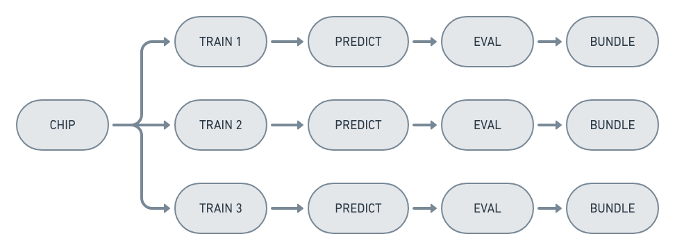

Running Experiments
===================

Running experiments in Raster Vision is done by the :ref:`run cli command` ``rastervision`` command.
This looks in all the places stated by the command for :ref:`experiment set` classes and executes methods
to get a collection of :ref:`experiment` objects. These are fed into the ``ExperimentRunner`` that
is chosed as a command line argument, which then determines how the commands derived from the
experiments should be executed.

.. _experiment runner:

ExperimentRunners
-----------------

An ``ExperimentRunner`` takes a collection of :ref:`experiment` objects and executes commands
derived from those configurations. The commands it chooses to run are based on what commands
are requested from the user, what commands already have been run, and what commands are common
between ExperimentConfigs.

.. note:: Raster Vision considers two commands to be equal if their inputs, outputs and command types
          (e.g. rv.CHIP, rv.TRAIN, etc...) are the same. Raster Vision will avoid running multiple of
          the same command in one run with sameness defined in this way.

During the process of deriving commands from the ExperimentConfigs, each Config object in the
experiment has the chance to update itself for a specific command, and declare what its inputs
and outputs are. This is an internal mechanism, so you won't have to dive too deeply into this
unless you are a contributor or a plugin author. However, it's good to know that this
is when some of the implicit values are set into the configuration. For instance,
the ``model_uri`` property can be set on a ``rv.BackendConfig`` by using the ``with_model_uri``
on the builder; however the more standard practice is to let Raster Vision set this property
during the "update_for_command" process described above, which it will do based on the
root_uri of the ExperimentConfig as well as other factors.

The parent ExperimentRunner class constructs a Directed Acyclic Graph (DAG) of the commands
based on which commands consume as input other command's outputs, and passes that off
to the implementation to be executed. The specific implementation will choose how to
actually execute each command.

When an ExperimentSet is executed by an ExperimentRunner, it is first converted into a CommandDAG representing a directed acyclic graph (DAG) of commands. In this graph, there is a node for each command, and an edge from X to Y if X produces the input of Y. The commands are then executed according to a topological sort of the graph, so as to respect dependencies between commands.

Two optimizations are performed to eliminate duplicated computation. The first is to only execute commands whose outputs don't exist. The second is to eliminate duplicate nodes that are present when experiments partially overlap, like when an ExperimentSet is created with multiple experiments that generate the same chip:

Running locally
---------------

A ``rastervision run local ...`` command will use the ``LocalExperimentRunner``, which
simply executes each command in the DAG on the client machine. These run serially, without
any parallelization. In future versions, we may want to split the DAG up into components
that can be executed in parallel on a large machine.

.. _aws batch:

Running on AWS Batch
--------------------

``rastervision run aws_batch ...`` will execute the commands on AWS Batch. This provides
a powerful mechanism for running Raster Vision experiment workflows. It allows
for queues of GPU instances to have 0 instances running when not in use. With the running of a
single command on your own machine, AWS Batch will increase the instance count to meet
the workload with low-cost spot instances, and terminate the instances when the queue
of commands is finished.

The ``AWSBatchExperimentRunner`` executes each command as a call to ``rastervision run_command``
inside of the Docker image configured in the job definition that is sent to AWS Batch.
Commands that are dependent on an upstream command are submitted as a job after the upstream
command's job, with the jobId of the upstream command job as the parent jobId. This way
AWS Batch knows to wait to execute each command until all upstream commands are finished
executing, and will fail the command if any upstream commands fail.

If you are running on AWS Batch or any other remote runner, you will not be able to use
your local file system to store any of the data associated with an experiment - this
includes plugin files.

.. note::
   To run on AWS Batch, you'll need the proper setup. See :ref:`aws batch setup` for instructions.
