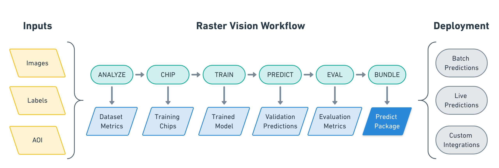

.. rst-class:: hide-header

.. currentmodule:: rastervision2

|

.. image:: _static/raster-vision-logo-index.png
    :align: center
    :target: https://rastervision.io

|

**Raster Vision** is an open source framework for Python developers building computer
vision models on satellite, aerial, and other large imagery sets (including
oblique drone imagery). There is built-in support for chip classification, object detection, and semantic segmentation using PyTorch and Tensorflow.

.. image:: _static/cv-tasks.png
    :align: center

Raster Vision allows engineers to quickly and repeatably
configure *pipelines* that go through core components of a machine learning
workflow: analyzing training data, creating training chips, training models,
creating predictions, evaluating models, and bundling the model files and
configuration for easy deployment.

The input to a Raster Vision pipeline is a set of images and training data,
optionally with Areas of Interest (AOIs) that describe where the images are labeled.
The output of a Raster Vision pipeline is a bundle of model and configuration that allows you to
easily utilize models in various deployment scenarios.

The pipelines include running the following commands:
7
* **ANALYZE**: Gather dataset-level statistics and metrics for use in downstream processes.
* **CHIP**: Create training chips from a variety of image and label sources.
* **TRAIN**: Train a model using a "backend" such as PyTorch.
* **PREDICT**: Make predictions using trained models on validation and test data.
* **EVAL**: Derive evaluation metrics such as F1 score, precision and recall against the model's predictions on validation datasets.
* **BUNDLE**: Bundle the trained model into a :ref:`rv2_model bundle`, which can be deployed in batch processes, live servers, and other workflows.

Pipelines are configured using a compositional, programmatic approach that makes configuration easy to read, reuse
and maintain.

.. code-block:: python

    # tiny_spacenet.py

    from os.path import join

    from rastervision2.core.rv_pipeline import *
    from rastervision2.core.backend import *
    from rastervision2.core.data import *
    from rastervision2.pytorch_backend import *
    from rastervision2.pytorch_learner import *

    def get_config(runner):
        root_uri = '/opt/data/output/'
        base_uri = ('https://s3.amazonaws.com/azavea-research-public-data/'
                    'raster-vision/examples/spacenet')
        train_image_uri = '{}/RGB-PanSharpen_AOI_2_Vegas_img205.tif'.format(
            base_uri)
        train_label_uri = '{}/buildings_AOI_2_Vegas_img205.geojson'.format(
            base_uri)
        val_image_uri = '{}/RGB-PanSharpen_AOI_2_Vegas_img25.tif'.format(base_uri)
        val_label_uri = '{}/buildings_AOI_2_Vegas_img25.geojson'.format(base_uri)
        channel_order = [0, 1, 2]
        class_config = ClassConfig(
            names=['building', 'background'], colors=['red', 'black'])

        def make_scene(scene_id, image_uri, label_uri):
            """
            - StatsTransformer is used to convert uint16 values to uint8.
            - The GeoJSON does not have a class_id property for each geom,
            so it is inferred as 0 (ie. building) because the default_class_id
            is set to 0.
            - The labels are in the form of GeoJSON which needs to be rasterized
            to use as label for semantic segmentation, so we use a RasterizedSource.
            - The rasterizer set the background (as opposed to foreground) pixels
            to 1 because background_class_id is set to 1.
            """
            raster_source = RasterioSourceConfig(
                uris=[image_uri],
                channel_order=channel_order,
                transformers=[StatsTransformerConfig()])
            label_source = SemanticSegmentationLabelSourceConfig(
                raster_source=RasterizedSourceConfig(
                    vector_source=GeoJSONVectorSourceConfig(
                        uri=label_uri, default_class_id=0, ignore_crs_field=True),
                    rasterizer_config=RasterizerConfig(background_class_id=1)))
            return SceneConfig(
                id=scene_id,
                raster_source=raster_source,
                label_source=label_source)

        dataset = DatasetConfig(
            class_config=class_config,
            train_scenes=[
                make_scene('scene_205', train_image_uri, train_label_uri)
            ],
            validation_scenes=[
                make_scene('scene_25', val_image_uri, val_label_uri)
            ])

        # Use the PyTorch backend for the SemanticSegmentation pipeline.
        chip_sz = 300
        backend = PyTorchSemanticSegmentationConfig(
            model=SemanticSegmentationModelConfig(backbone=Backbone.resnet50),
            solver=SolverConfig(lr=1e-4, num_epochs=1, batch_sz=2))
        chip_options = SemanticSegmentationChipOptions(
            window_method=SemanticSegmentationWindowMethod.random_sample,
            chips_per_scene=10)

        return SemanticSegmentationConfig(
            root_uri=root_uri,
            dataset=dataset,
            backend=backend,
            train_chip_sz=chip_sz,
            predict_chip_sz=chip_sz,
            chip_options=chip_options)

Raster Vision uses a ``unittest``-like method for executing pipelines. For instance, if the
above was defined in `tiny_spacenet.py`, with the proper setup you could run the experiment
on AWS Batch by running:

.. code:: shell

   > rastervision2 run aws_batch -p tiny_spacenet.py

See the :ref:`rv2_quickstart` for a more complete description of using this example.

.. _rv2_documentation:

Documentation
==================

This part of the documentation guides you through all of the library's
usage patterns.

.. toctree::
   :maxdepth: 2

   quickstart
   setup
   cli
   architecture
   api
   bootstrap

CHANGELOG
---------

.. toctree::
   :maxdepth: 3

   changelog
