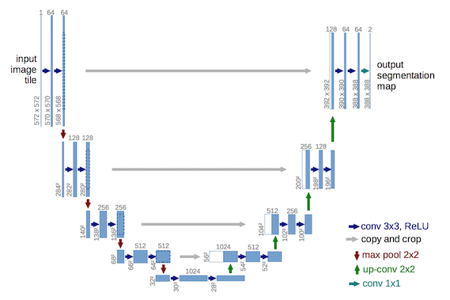
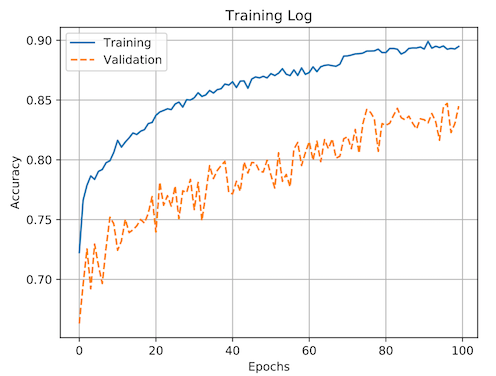
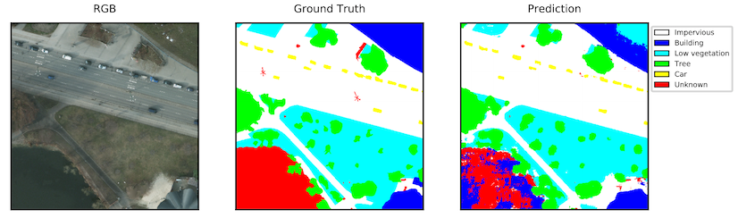

## Introduction

For our first entry to the [ISPRS Potsdam 2D Semantic Labeling Contest](http://www2.isprs.org/commissions/comm3/wg4/2d-sem-label-potsdam.html),
we wanted to keep things simple, and decided to use a single, off-the-shelf model without
using pre-training.

## Experiment

This experiment used a simplified version of U-Net [1], which is an encoder-decoder convolutional neural network architecture for semantic segmentation. The following figure is taken from [1]
and shows the idealized model architecture.

We trained the model for
100 epochs with 4096 samples per epoch with a batch size of 8 using the Adam
optimizer.
The learning rate started at 0.001 and was divided by 10 after
the validation loss did not improve for ten epochs.
The input to the network included red, green, blue, infrared, NDVI,
and normalized depth channels which were concatenated together. The training
data was randomly augmented using 90 degree rotations and horizontal and
vertical flips, and was based on 80% of the labeled data.

This experiment was configured in [this file](https://github.com/azavea/keras-semantic-segmentation/blob/develop/src/experiments/3_21_17/unet_all.json).

## Results

The training process took ~12 hrs on an NVIDIA Tesla K80 GPU and the learning
curves can be seen below.

To evaluate the model, large prediction images were generated (2000x2000 for validation, 6000x6000 for test), and the predictions were compared to the ground truth. To account for the uncertainty around segment boundaries, a 3 pixel radius around each segment was ignored.
The results are better on the test set, and I suspect that is because the validation set is much smaller and by chance contains some difficult regions.

The overall score is the accuracy including clutter, and the score for each
category is the F1 score for that category

| | Overall | Impervious | Building | Low Vegetation | Tree | Car | Clutter |
| --- | --- | --- | --- | --- | --- | --- | --- |
| Validation | 85.8 | 89.1 | 91.8 | 82.0 | 83.3 | 93.7 | 63.2 |
| Test | 89.2 | 91.4 | 96.1 | 86.1 | 86.6 | 93.3 | 46.8 |

Our overall score was within 1.1% of the top entrant, which is good considering that we used a single, off-the-shelf model without the use of pre-training. Here is an example of a relatively high-quality segmentation.

Here is an example of a relatively poor-quality segmentation. The model has trouble segmenting the lake in the lower left corner, perhaps due to looking similar to a parking lot. It's also odd that it segments part of it as impervious and part of it as clutter. The model also
has trouble with the building in the upper right corner.

The full results on the test set generated by the contest organizers can be viewed  [here](http://ftp.ipi.uni-hannover.de/ISPRS_WGIII_website/ISPRSIII_4_Test_results/2D_labeling_potsdam/2D_labeling_Potsdam_details_AZ1/index.html).

## References

[1] Ronneberger, Olaf, Philipp Fischer, and Thomas Brox. "U-net: Convolutional networks for biomedical image segmentation." In *International Conference on Medical Image Computing and Computer-Assisted Intervention*, 2015
