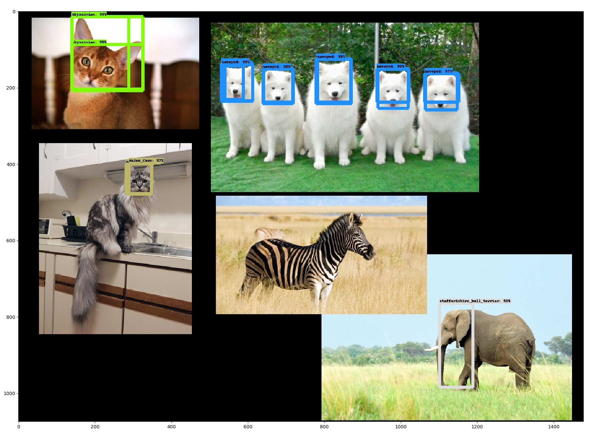
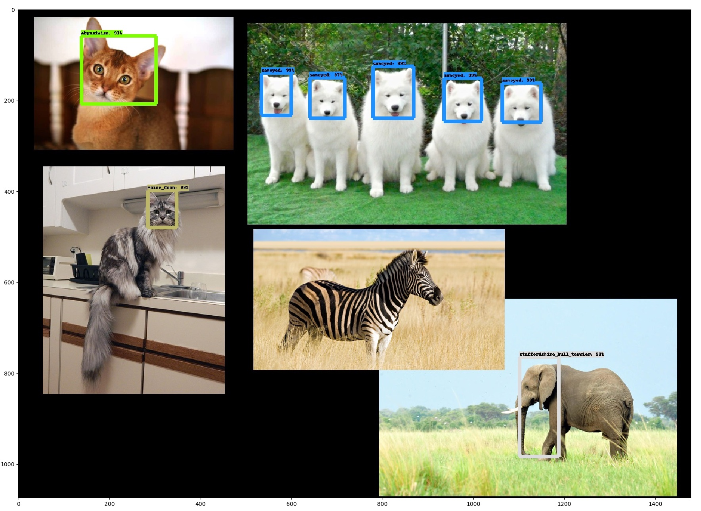

### Overview
This is a demonstration of how to use the Tensorflow Object Detection API to train a detection model and then make predictions with it on AWS EC2. It uses the Pets dataset, but it should be easy to swap this out for the ships dataset using the `create_ships_tf_record.py` script. This code is very different than the rest of the Raster Vision codebase, so it's in its own directory which is `src/detection`. The TF API doesn't have a pip installer so I've just included it in the repo for now.

### Training a model on EC2
To start a training job, run the following from the VM
```
src/detection/scripts/batch_submit.py lf/detect \
    /opt/src/detection/scripts/train_ec2.sh \ configs/ssd_mobilenet_v1_pets.config pets0
```
You can view the progress of the training using Tensorboard by pointing your browser at `<ec2 instance ip>:6006`. When you are satisfied with the results, you need to kill the job since it's running in an infinite loop. Recent model checkpoints are synced to the S3 bucket under `results/detection/pet0`.


### Making predictions for individual images on EC2
To start a prediction job, you can run
```
src/detection/scripts/batch_submit.py lf/detect \
    /opt/src/detection/scripts/predict_ec2.sh \
    /opt/src/detection/configs/ssd_mobilenet_v1_pets.config pets0 135656
```
which will put predictions in the S3 bucket in `results/detection/pets0/predictions`.

### Making predictions for a large image with many objects locally
The neural network can only handle small images with a fixed size. Therefore, for large images which contain many objects, we use the following strategy. First, we slide a window over the large image and generate a directory
full of window images. Then, we run the usual predict script over that directory
of images. Finally, we aggregate the predictions on the windows, taking into
account the offset of each window within the larger image.

The following commands assume that you have the frozen inference graph at `/opt/data/results/detection/pets0/output_inference_graph.pb` and the [animal montage image](src/detection/img/animal_montage.jpg) at `/opt/data/datasets/detection/pets/images_subset/animal_montage.jpg`.
Running these should generate output at `/opt/data/results/detection/windows`.
```
python scripts/make_windows.py \
    --image-path /opt/data/datasets/detection/pets/images_subset/animal_montage.jpg \
    --output-dir /opt/data/results/detection/windows \
    --window-size 300

python scripts/predict.py \
    --frozen_graph_path=/opt/data/results/detection/pets0/output_inference_graph.pb \
    --label_map_path=/opt/data/datasets/detection/pets/pet_label_map.pbtxt \
    --input_dir=/opt/data/results/detection/windows/windows \
    --output_dir=/opt/data/results/detection/windows/predictions

python scripts/aggregate_predictions.py \
    --image-path /opt/data/datasets/detection/pets/images_subset/animal_montage.jpg \
    --window-info-path /opt/data/results/detection/windows/window_info.json \
    --predictions-path /opt/data/results/detection/windows/predictions/predictions.json \
    --label-map-path /opt/data/datasets/detection/pets/pet_label_map.pbtxt \
    --output-dir /opt/data/results/detection/windows
```
Due to the sliding window approach, sometimes there are multiple detections where there should be one, so we group them using a clustering algorithm in OpenCV. There is an `eps` parameter in `detection/scripts/aggregate_predictions.py` that will probably need to be tuned further depending on the dataset. Here are the predictions before and after grouping.



### Converting to TFRecord format
The real ships dataset isn't ready yet, so we are using a mock ships dataset. To convert this to TFRecord format, run this command locally in the CPU container.
```
python src/detection/scripts/create_ships_tf_record.py \
    --data_dir=/opt/data/datasets/detection/mock_ships \
    --output_dir=/opt/data/datasets/detection/mock_ships \
    --label_map_path=/opt/data/datasets/detection/mock_ships/ships_label_map.pbtxt
```
